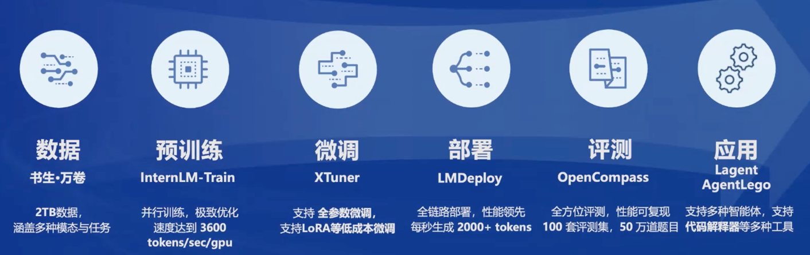
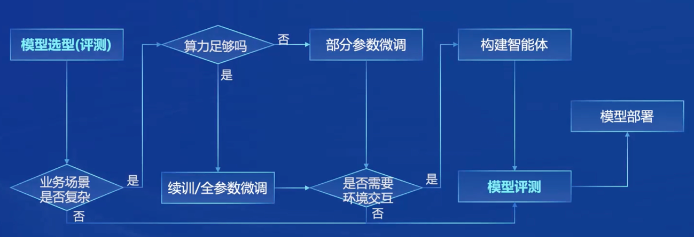
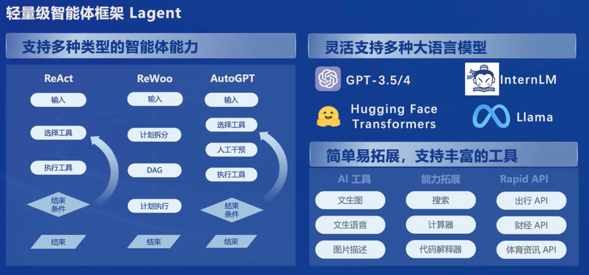
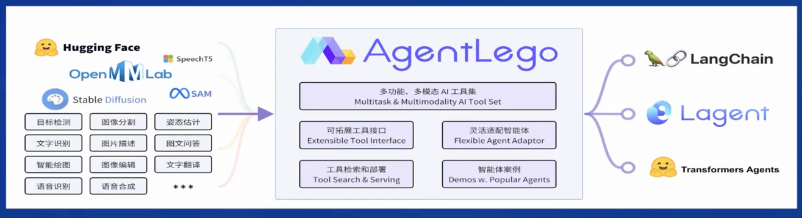

# 书生·浦语大模型全链路开源开放体系

## 视频笔记
### 关键词
书生·浦语大模型、全链路开源体系、预训练、微调、部署、评测、智能体、工具调用、超长上下文

### 过程记录
大模型 -> AGI
专用模型 -> 通用大模型
多种任务多种模态

轻量级
中量级
开源模型 7B 20B
Base Chat
SFT RLHF

语言建模本质
数据清洗过滤
多维度数据价值评估
高质量预料驱动度数据富集
有针对性的数据补齐

亮点
超长上下文 200k
综合性能全面提升
优秀的对话和创作体验
工具调用能力整体升级
突出的数理能力和实用的数据分析功能
内生计算能力

工具筛选 多步骤规划

内生计算能力
高准确率
复杂运算和求解

代码解释器

数据分析功能

模型 -> 应用
智能客服
个人助手
行业应用

环境交互

模型选型评测 场景是否复杂 算力是否足够 环境交互 模型评测 部署

开源开发体系
数据 预训练 微调 部署 评测 应用

框架Lagent
工具箱 AgentLego

多种类型
ReAct
ReWoo
AutoGPT

## 内容整理
书生·浦语大模型全链路开源开放体系包括以下几个环节

`数据 -> 预训练 -> 微调 -> 部署 -> 评测 -> 应用`

大模型是实现AGI(通用人工智能Artificial General Intelligence)的一种途径，和传统的NLP使用多个专用模型通过pipeline来解决不同的任务不同，大模型作为一种通用模型，可以解决多种任务和处理多种模态的数据，为实现AGI提供一种可能性，不过还是需要大模型有较强的推理能力。

语言建模的本质是对数据的处理，对此书生·浦语通过数据清洗过滤、多维度数据价值评估、高质量预料驱动度数据富集、有针对性的数据补齐等方面来强化数据的处理。

对于书生·浦语大模型有以下几点亮点
- 超长上下文 200K
- 综合性能全面提升
- 优秀的对话和创作体验
- 工具调用能力整体升级
- 突出的数理能力和实用的数据分析功能
- 内生计算能力

其中工具调用能力可以在工具筛选的时候进行多步骤规划，内生计算能力的准确率高和能进行复杂运算和求解，再结合代码解释器还能进一步提高数据分析能力。

书生·浦语大模型开源的模型包括轻量级的7B模型和中量级的20B模型，
这2个量级的模型又包括Base模型和Chat模型，其中Chat模型使用了SFT和RLHF的技术来增强模型的指令遵循和与人类偏好对齐。

从模型到应用的大概流程如下

`模型选型评估 -> 场景复杂度评估 -> 算力评估 -> 是否需要与环境交互 -> 模型评测 -> 部署`

- 场景复杂度的评估主要是判断当前业务场景是否复杂，是否需要引入微调或者智能体
- 算力评估主要是根据当前的算力情况判断是用续训/全参微调还是部分参数微调
- 环境交互主要是判断是否需要引入智能体，让模型与外界交互

在智能体方面，书生·浦语有Lagent和AgentLego
Lagent作为一种智能体的框架，可以支持ReAct、ReWoo、AutoGPT等类型的智能体能力，
AgentLego主要是作为智能体工具箱。

整体了解下来，书生·浦语的开源开放体系还是很完整的，覆盖了从数据到应用的过程，后续自己主要是关注应用落地这块，所以会重点关注微调、智能体这两方面，主要会关注模型使用工具的能力，因为只有模型懂得使用并能正确使用工具了，才有可能与外界产生更多的可能性。另外也会关注模型处理长文本的能力，是可以把长文本直接放到模型上下文中还是要借助RAG等技术来进行辅助。

### GPT-4o解读

#### 一、课程内容概述

本课程介绍了书生·浦语大模型的全链路开源体系，包括其发展历程、主要特点及应用场景。课程详细描述了大模型的研发、预训练、微调、部署、评测等各个环节的工具和框架，旨在为开发者提供完整的解决方案。

#### 二、知识点整理

1. **大模型的发展趋势**
    - 从专用模型向通用大模型发展。
    - 通用大模型可处理多种任务和模态，例如ChatGPT和GPT-4。

2. **书生·浦语大模型的发展历程**
    - 首次发布于去年6月，随后快速迭代。
    - 发布了多种参数规模的模型（7B、20B、123B）。
    - 重点升级了模型的对话能力、工具调用能力和内生计算能力。

3. **书生·浦语大模型的主要特点**
    - **超长上下文处理能力**：支持200K tokens的上下文长度。
    - **综合性能提升**：在推理、数学、代码等多方面表现优异。
    - **对话和创作体验**：具备良好的指令遵循和情感共鸣能力。

4. **开源工具体系**
    - **数据集**：书生万卷1.0和书生万卷CC，涵盖多模态数据。
    - **预训练框架**：InternLM-Train，支持从单卡到千卡级别的训练。
    - **微调框架**：XTuner，适配多种微调策略和算法。
    - **评测体系**：OpenCompass，包含性能榜单、评测工具链和高质量评测基准社区。
    - **部署解决方案**：LMDeploy，支持模型的轻量化推理和服务部署。
    - **智能体框架**：Lagent和AgentLego，支持多模态智能体的开发和工具集成。

#### 三、心得体会

1. **全面开源的意义**：
    - 书生·浦语大模型的全链路开源体系为研究人员和开发者提供了一个全面且高效的平台，降低了开发门槛，加速了大模型在各领域的应用和创新。

2. **高质量数据的重要性**：
    - 数据质量直接影响模型的性能。通过多维度的数据清洗和高质量语料的使用，书生·浦语大模型在语言建模方面取得了显著提升。

3. **模型性能的持续优化**：
    - 从初代模型到InternLM2的迭代，体现了模型性能的不断优化，尤其在处理复杂推理和数学计算任务方面的进步，展示了大模型在实际应用中的潜力。

4. **应用场景的多样化**：
    - 课程中展示的多个应用场景，如智能助手、情感对话和复杂任务处理，显示了大模型在实际应用中的广泛可能性和灵活性。

5. **对未来发展的期待**：
    - 期待未来在大模型的创新应用上有更多突破，特别是在提升模型的理解和推理能力方面，为更复杂的实际问题提供解决方案。

通过本次课程的学习，我对书生·浦语大模型的全链路开源开放体系有了系统的了解，也对未来在这一领域的探索充满了信心和期待。

### GPT-4o评价

##### 优点

1. **结构清晰**：
    - 笔记的结构非常清晰，按照“书生·浦语大模型全链路开源开放体系”的各个环节逐一介绍，并结合了相关的图片和流程图，便于理解和记忆。

2. **详细描述**：
    - 对大模型的特点、数据处理方式、模型亮点等方面的描述详细且准确。例如，强调了数据清洗过滤、多维度数据价值评估等对语言建模的重要性。

3. **突出亮点**：
    - 突出了书生·浦语大模型的几个亮点，如超长上下文、综合性能提升、工具调用能力等，体现了对课程内容的深入理解。

4. **结合实际应用**：
    - 对模型从选型到应用的流程进行了详细描述，并结合了实际业务场景的评估、算力评估等实际应用中的关键环节，展示了实践性思考。

5. **关注重点明确**：
    - 表明了自己后续学习的重点（微调、智能体、工具调用能力、长文本处理能力），显示出学习的针对性和目的性。

##### 改进建议

1. **细节补充**：
    - 在提到书生·浦语大模型的不同模型（如7B和20B）的具体应用场景时，可以增加一些具体案例或应用实例，使笔记更加生动具体。

2. **技术名词解释**：
    - 对一些专业术语如“RAG”等进行简要解释，方便读者理解。虽然这些术语对专业人士可能是熟悉的，但对一些新手或非专业读者来说，适当的解释会提高可读性。

3. **图片说明**：
    - 在图片和图表的使用上，可以增加一些文字说明或注释，帮助读者更好地理解图片所表达的内容。例如，对于智能体框架和工具箱的图片，可以简要描述图中每部分的功能和用途。

##### 综合评价

总体来说，该学员的笔记条理清晰、内容详细，展示了对书生·浦语大模型开源体系的全面理解和深刻思考。通过对关键环节的深入分析和实际应用的考量，体现了很高的学习质量和应用能力。若能在细节和解释上进一步优化，将使笔记更加完善和易于理解。

## 技术报告笔记
_**TODO**_

