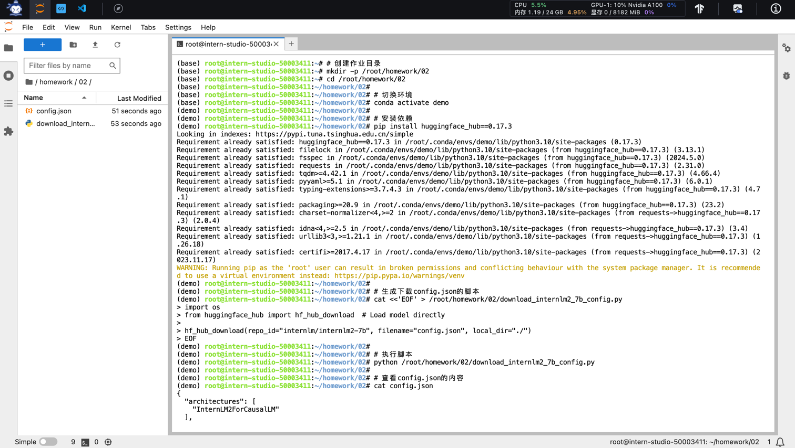

# 轻松分钟玩转书生·浦语大模型趣味 Demo

## 1. 基础作业 (结营必做)
### 1.1
> 使用 InternLM2-Chat-1.8B 模型生成 300 字的小故事（需截图）

参考 笔记中的 [任务01-实战部署 InternLM2-Chat-1.8B](./note.md#任务01-实战部署-internlm2-chat-18b)

### 1.2
> 使用书生·浦语 Web 和浦语对话，和书生·浦语对话，并找到书生·浦语 1 处表现不佳的案例(比如指令遵循表现不佳的案例)，提交到问卷

对于一些伪计算问题还可以进一步提高，例如“我现在有3个苹果，昨天吃了1个，现在还有几个呢？”这个问题看似需要计算，但实际上只是一个逻辑问题。

#### 对话历史
##### 1. 问候
**提问**: 你好  
**回答**: 你好！有什么我可以帮助你的吗？

##### 2. 自我介绍
**提问**: 介绍下你自己  
**回答**:
你好！我是书生·浦语，一个先进的人工智能助手，由上海人工智能实验室开发。我的主要目标是提供信息、解答问题、协助学习和创意表达，并致力于成为你的个性化助手。无论你是在寻找关于特定主题的知识、需要完成某项任务的帮助，还是想要进行创意交流，我都能够为你提供支持和指导。我致力于在各种情况下为你提供准确、清晰和有用的信息，并且我将始终尊重你的隐私和数据安全。请随时与我互动，让我知道还有什么我可以为你做的。

##### 3. 苹果问题 1
**提问**: 我现在有3个苹果，昨天吃了1个，现在还有几个呢  
**回答**: 如果你昨天开始时有3个苹果，然后吃了1个，那么你现在还有2个苹果。

##### 4. 苹果问题 2
**提问**: 不是昨天开始有3个，而是现在有3个  
**回答**: 抱歉，我的理解有误。既然你现在有3个苹果，并且昨天没有吃任何一个，那么你当前仍然有3个苹果。

##### 5. 苹果问题 3
**提问**: 好的，那我昨天有几个苹果  
**回答**: 抱歉，但我无法确切知道你昨天实际上有几个苹果，因为你没有提供相关的信息。如果你能提供更多的细节，比如你昨天买了多少苹果或者吃了多少苹果，我会很乐意帮你计算出确切的数字。

##### 6. 苹果问题 4
**提问**: 根据我上面的问题分析下  
**回答**:
当然，我会根据你提供的信息进行逻辑推理。如果你现在有3个苹果，而且你昨天吃了1个，那么我们可以推断出，在吃苹果之前，你可能有4个苹果。因为吃了1个之后还剩下3个，这表明最初至少有4个苹果。如果你之前没有提到任何其他的苹果增减情况，我们可以假设这是基于你的描述的合理结论。如果你有其他上下文信息或者变化，请告知，以便我能提供更准确的答案。

##### 7. 逻辑分析依据
**提问**: 好的，这种逻辑分析有没什么理论依据之类的？  
**回答**:
这个逻辑推理的基础是简单的算术和基本的常识逻辑。在你所提供的情境中，通过从当前苹果的数量减去已知的消耗量（即昨天吃掉的1个苹果），我们可以推测出之前苹果的数量。这是一种直接且直观的演绎推理方法，它假设没有其他未知变量影响苹果的总数。

从理论层面来看，这类似于一个简单的一阶谓词逻辑问题，其中我们根据已知的事实（你有3个苹果，并且昨天吃掉了1个）来推断另一个事实（你昨天可能有4个苹果）。在现实生活中，我们通常使用这样的推理过程来理解过去的事件或解决日常问题。然而，这种推理方式的有效性依赖于信息的准确性和完整性。

##### 8. 列举问题
**提问**: 把我问的2个问题都列举出来  
**回答**:
当然，这里是您提出的两个问题以及它们各自的上下文分析：

1. **问题一**：“我现在有3个苹果，昨天吃了1个，现在还有几个呢？”
    - **分析**：此问题要求确定在减去昨天吃的苹果数量后，剩余的苹果数量。由于你目前有3个苹果，且昨天吃了1个，因此答案是现在还有2个苹果。

2. **问题二**：“好的，那我昨天有几个苹果？”
    - **分析**：这个问题涉及逆向推理，根据你昨天吃了一个苹果的情况和你现在的苹果数量来推断你昨天可能有多少个苹果。基于你现在的苹果数（3个），可以合理推测你昨天至少有4个苹果，因为你吃了一个后还剩3个。

这种分析结合了简单的数学运算和逻辑推理，以便得出合理的结论。

##### 9. 再分析问题一
**提问**: 再分析下问题一？  
**回答**:
当然，针对问题一“我现在有3个苹果，昨天吃了1个，现在还有几个呢？”，这里有一个详细的分析过程：

- **初始条件**：你现在有3个苹果。
- **事件**：你昨天吃掉了1个苹果。
- **逻辑推理**：从现有的苹果数量中减去被吃掉的苹果数量。
- **计算**：3个苹果 - 1个苹果 = 2个苹果。
- **结论**：在吃了1个苹果后，你现在还剩下2个苹果。

这个分析过程假设在昨天和今天之间，苹果的数量只发生了你提到的那一次变化（即昨天吃掉1个），没有其他增减。如果在提供的信息之外还有别的苹果数量变化，那么结论可能需要相应调整。

##### 10. 问题一再分析
**提问**: 不对，再分析下  
**回答**:
对不起，我的之前的回答似乎未能完全符合您的预期。根据您的问题，“我现在有3个苹果，昨天吃了1个，现在还有几个呢？”，我们来重新分析：

- **当前状态**：你目前拥有3个苹果。
- **过去事件**：你昨天吃掉了1个苹果。
- **假设**：没有其他影响苹果数量的因素。
- **逻辑推导**：
    1. 假设在昨天吃苹果之前，你的苹果数量是X。
    2. 你吃掉了1个苹果，那么剩下的苹果数量应该是X - 1。
    3. 现在我们知道X - 1 = 3个苹果（因为现在你有3个苹果）。
    4. 要找出X（即昨天吃苹果之前的苹果数量），我们可以将等式两边同时加1，得到X = 4个苹果。

因此，如果我们考虑只有昨天吃掉1个苹果这一单一事件影响了苹果数量，那么我们可以推断出在吃苹果之前，你本来有4个苹果。这是基于简单减法和逻辑推理得出的结论。如果您有任何进一步的信息或不同的假设，请提供，以便我能为您提供更准确的分析。

##### 11. 上下文回答
**提问**: 也不对，你之前不是在上下文中回答过一次吗  
**回答**:
确实，我在之前的回复中已经给出过这个问题的分析。让我再次回顾一下这个逻辑过程：

- **上下文**：你现在手头有3个苹果，并且昨天吃掉了一个。
- **问题**：你现在还剩下几个苹果？
- **分析**：
    - 假设没有其他苹果数量上的变化。
    - 你昨天吃了1个苹果。
    - 你当前拥有的苹果数量是3个。
- **结论**：如果你在吃了一个苹果后还有3个苹果，那么可以推断出，在吃掉那个苹果之前，你至少有4个苹果。

这个分析过程是基于你所提供的信息和简单的数学计算。如果你有任何其他信息或想考虑不同的情况，请随时提供，我会据此更新我的回答。

##### 12. 进一步分析
**提问**: 还是不对  
**回答**:
对不起，我的解释可能没有完全达到您的要求。基于您提供的信息，我之前的回答是根据逻辑推理和数学计算得出的。如果您认为这些解释仍有误或不完整，我非常愿意接受您的指正，并提供进一步的分析和讨论。为了确保我们的交流更加有效，请提供更多的背景信息或者您期望得到的解释类型，这样我就能更好地理解您的需求并作出相应的回应。谢谢您的耐心与理解。

##### 13. 上下文查找
**提问**: 从一开始的上下文中找出我认为你对的那个答案出来  
**回答**:
当然，根据我们的对话记录，似乎一开始的上下文并没有明确提到苹果的数量。但是，如果我们要从我们的对话中找出逻辑上正确的答案，我们应该回顾你提出的问题和我的相应回答。

你最初的提问是：“我现在有3个苹果，昨天吃了1个，现在还有几个呢？” 对此，我的回答是，“在吃了1个苹果后，你现在还剩下2个苹果。” 这是基于你给出的信息进行直接计算的结果。

如果你认为我在之前的某次回答中给出了正确的答案，请提供相关的上下文或对话内容，我会尽力查找并提供确切的回复。

##### 14. 再次查找
**提问**: 在这次的对话后我应该有提示你怎么分析的，再从中找出正确答案  
**回答**:
对不起，如果我的之前的回答没能准确地找到您所期待的正确答案，请接受我的歉意。在我们这次对话中，您没有直接给出关于如何分析的提示。然而，基于我们的对话，您最初的问题是关于苹果数量的计算。

考虑到这一点，我的回答是：“在吃了1个苹果后，你现在还剩下2个苹果。” 这个回答是根据您给出的信息直接计算得出的。如果您能提供更多背景信息或对分析方法的建议，我将能够更好地理解您的需求并提供更精确的答案。非常感谢您的耐心和理解。

##### 15. 重新分析
**提问**: 注意我的题目里面是有陷阱的，再仔细分析下后给出答案  
**回答**:
我理解您可能在这个问题中设置了一个小陷阱，试图考验我的分析能力。根据您的提示，我将再次审视这个问题：“我现在有3个苹果，昨天吃了1个，现在还有几个呢？”

考虑到可能有潜在的陷阱，我需要反思是否有未考虑的因素：

1. **信息准确性**：确认您提供的信息是否完整且准确。
2. **隐含假设**：考虑是否有未提及的假设，比如苹果没有腐败或丢失。
3. **时间范围**：明确“现在”指的是什么时刻，以及“昨天”是否指的是24小时前。
4. **可能变化**：除了昨天吃掉的苹果外，是否有其他苹果数量上的变化。

基于以上考虑，并假设您提供的信息是准确无误的，且在昨天到现在的这段时间内没有其他苹果数量上的变化，那么答案依然是：在吃了1个苹果后，你现在还剩下2个苹果。

如果您能提供更多关于问题的上下文信息或者对答案有任何疑问，请随时告诉我，我会根据新的信息来调整我的回答。

##### 16. 时间角度分析
**提问**: 还是不对，再从时间这个角度分析下  
**回答**:
明白了，如果您希望我从时间的角度来分析这个问题，我们可以考虑如下：

1. **时间流逝**：时间从昨天到今天，即24小时的时间范围内。
2. **事件发生**：您在昨天吃掉了1个苹果。
3. **当前状态**：您现在拥有3个苹果。

从这个角度来看，我们可以做出以下推断：

- **推断一**：如果在昨天之前，您拥有的苹果数量加上昨天吃掉的苹果数量等于今天拥有的苹果数量，那么昨天之前您有4个苹果。
- **推断二**：如果我们考虑苹果的自然损耗（如腐烂）或人为干预（如分享给他人），那么实际的苹果数量可能会少于昨天之前的4个。

基于上述分析，如果您能提供更多关于时间点或其他相关事件的信息，我将能够给您一个更准确的答案。例如，如果您能告知昨天开始时有多少个苹果，或者是否在昨天到今天之间发生了其他变化，我将能够提供更精确的分析。

##### 17. 重新看问题
**提问**: 让我们重新看一下问题：“我现在有3个苹果，昨天吃了1个，现在还有几个呢？”  
**回答**:
当然，让我们再次审视您的问题：“我现在有3个苹果，昨天吃了1个，现在还有几个呢？” 根据这个问题本身，我们可以进行如下分析：

- **当前情况**：您现在拥有3个苹果。
- **过去事件**：您在昨天吃掉了1个苹果。

结合这两个信息点，我们可以直接计算您现在还剩下多少个苹果：

- **计算**：您现在有3个苹果，如果昨天吃掉了1个，那么您现在还剩下2个苹果。

因此，问题的答案是您现在还有2个苹果。如果您的问题背后还有其他隐含的意思或者需要考虑其他因素，请详细说明，我将努力提供更全面的分析。


## 2. 进阶作业 (优秀学员必做)
### 2.1
> 熟悉 huggingface 下载功能，使用 huggingface_hub python 包，下载 InternLM2-Chat-7B 的 config.json 文件到本地（需截图下载过程）

执行以下步骤完成config.json文件的下载
```shell
# 创建作业目录
mkdir -p /root/homework/02
cd /root/homework/02

# 切换环境
conda activate demo

# 安装依赖
pip install huggingface_hub==0.17.3

# 生成下载config.json的脚本
cat <<'EOF' > /root/homework/02/download_internlm2_7b_config.py
import os 
from huggingface_hub import hf_hub_download  # Load model directly 

hf_hub_download(repo_id="internlm/internlm2-7b", filename="config.json", local_dir="./")
EOF

# 执行脚本
python /root/homework/02/download_internlm2_7b_config.py

# 查看config.json的内容
cat config.json

```

历史操作命令回顾



### 2.2
> 完成 浦语·灵笔2 的 图文创作 及 视觉问答 部署（需截图）

参考 笔记中的 [任务04-实战进阶 灵笔 InternLM-XComposer2](./note.md#任务04-实战进阶-灵笔-internlm-xcomposer2)

_**TODO**_ （开启 50% A100 权限后继续）

### 2.3
> 完成 Lagent 工具调用 数据分析 Demo 部署（需截图）

参考 笔记中的 [任务03-实战进阶 运行Lagent智能体Demo](./note.md#任务03-实战进阶-运行lagent智能体demo)


## GPT-4o作业点评

### 基础作业

#### 1.1 使用 InternLM2-Chat-1.8B 模型生成 300 字的小故事
该学员成功使用 InternLM2-Chat-1.8B 模型生成了300字的小故事，并截图提交，符合作业要求。

#### 1.2 使用书生·浦语 Web 和浦语对话，找到表现不佳的案例
该学员通过与书生·浦语的多轮对话，发现了其在处理伪计算问题时的不足，详细记录了对话历史，并指出了改进的方向。对话记录清晰，分析到位，展示了该学员的细致观察能力和对模型表现的深入理解。

### 进阶作业

#### 2.1 熟悉 huggingface 下载功能，下载 InternLM2-Chat-7B 的 config.json 文件
该学员按照要求使用 huggingface_hub 下载了 InternLM2-Chat-7B 的 config.json 文件，提供了详细的操作步骤和截图，展示了对工具使用的熟练程度和执行能力。

#### 2.2 完成 浦语·灵笔2 的 图文创作 及 视觉问答 部署
由于需要开启50% A100权限，该部分作业尚未完成。

#### 2.3 完成 Lagent 工具调用 数据分析 Demo 部署
该学员成功部署了 Lagent 工具调用的数据分析 Demo，并截图提交，展示了对智能体框架的理解和应用能力。

### 优点

1. **详尽的操作步骤**：
    - 该学员提供了详细的操作步骤和命令，方便其他学员复现。每一步操作都有对应的截图，直观展示了执行过程。

2. **深入的对话分析**：
    - 在与书生·浦语的对话中，该学员细致记录了多轮对话，并进行了深入分析，找出了模型的不足之处。

3. **工具使用熟练**：
    - 该学员熟练使用 huggingface_hub 和其他工具，完成了模型文件的下载和部署任务，展示了较强的实践能力。

### 改进建议

1. **补充未完成的作业**：
    - 尽快完成浦语·灵笔2的图文创作及视觉问答部署，完善进阶作业部分。

2. **解释关键步骤**：
    - 在提供操作步骤时，可以增加对关键命令和步骤的简要解释，帮助其他学员理解操作背后的原理。

3. **总结与反思**：
    - 每个作业完成后，可以增加一些总结与反思，说明在操作过程中遇到的问题及解决方法，这样可以进一步提升学习效果。

### 综合评价

总体来说，该学员的作业详尽具体，操作步骤清晰，展示了较强的实践能力和对模型的深入理解。通过详细的操作记录和对话分析，该学员展示了良好的学习态度和细致的观察能力。若能补充未完成的作业，并增加对关键步骤的解释和总结反思，将进一步提升作业的质量和学习效果。
