# 轻松分钟玩转书生·浦语大模型趣味 Demo

## 视频笔记
### 关键词
书生·浦语大模型、InternLM2-Chat-1.8B、八戒-Chat-1.8B、Lagent、智能体、环境配置、模型下载、模型部署、Streamlit、数据分析、图文创作、视觉问答

### 内容整理
本节课主要以实战为主，从环境的搭建到模型的下载，再到模型的启动与访问，整体流程下来可以对大模型的运用有一个直观的了解与感受。
主要涉及到以下4个实战任务的操作与讲解。
- 任务01-实战部署 InternLM2-Chat-1.8B
- 任务02-实战部署 优秀作品 八戒-Chat-1.8B
- 任务03-实战进阶 运行Lagent智能体Demo
- 任务04-实战进阶 灵笔 InternLM-XComposer2

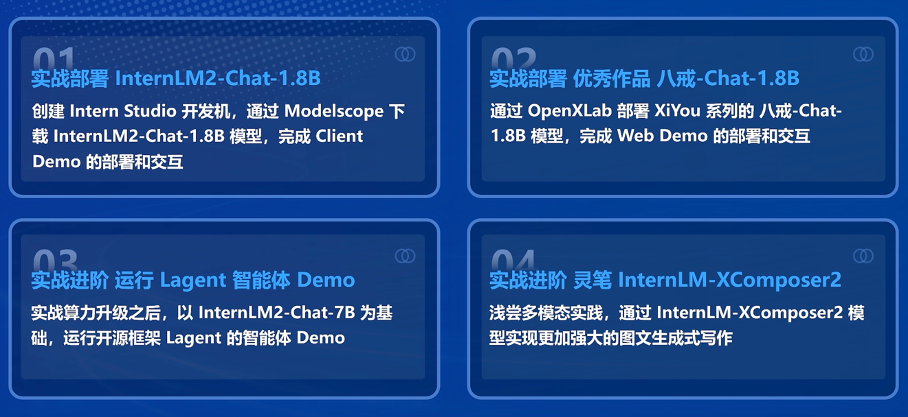

#### 环境配置
执行以下命令开始基础环境的配置，耗时会比较久，大约需要35分钟
```shell
studio-conda -o internlm-base -t demo
# 与 studio-conda 等效的配置方案
# conda create -n demo python==3.10 -y
# conda activate demo
# conda install pytorch==2.0.1 torchvision==0.15.2 torchaudio==2.0.2 pytorch-cuda=11.7 -c pytorch -c nvidia
```
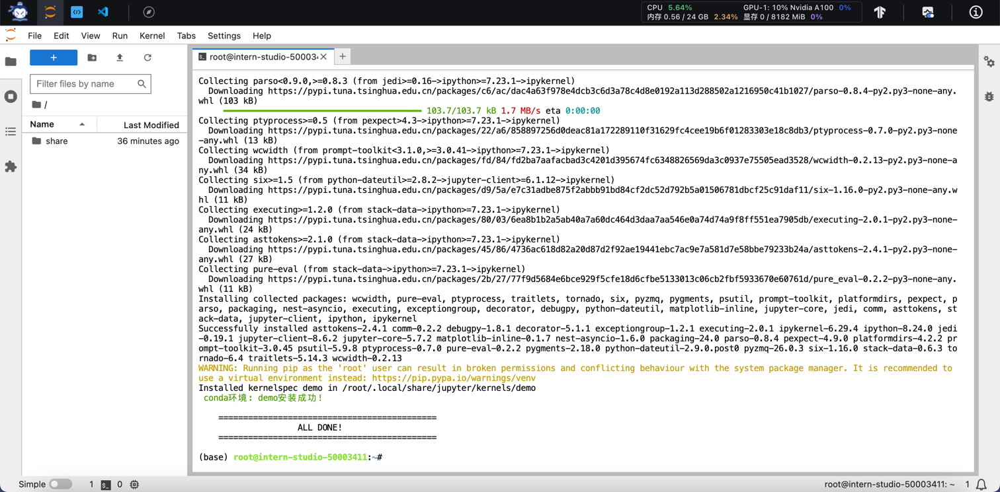

切换到demo环境后继续安装依赖包
```shell
conda activate demo

pip install huggingface-hub==0.17.3
pip install transformers==4.34 
pip install psutil==5.9.8
pip install accelerate==0.24.1
pip install streamlit==1.32.2 
pip install matplotlib==3.8.3 
pip install modelscope==1.9.5
pip install sentencepiece==0.1.99
```
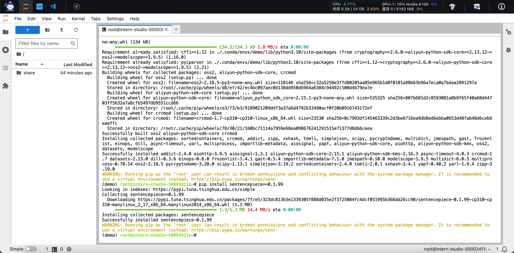

#### 任务01-实战部署 InternLM2-Chat-1.8B
创建demo路径与生成下载模型与运行模型的文件
```shell
mkdir -p /root/demo
touch /root/demo/cli_demo.py
touch /root/demo/download_mini.py
cd /root/demo
```

download_mini.py的内容
```python
import os
from modelscope.hub.snapshot_download import snapshot_download

# 创建保存模型目录
os.system("mkdir /root/models")

# save_dir是模型保存到本地的目录
save_dir="/root/models"

snapshot_download("Shanghai_AI_Laboratory/internlm2-chat-1_8b", 
                  cache_dir=save_dir, 
                  revision='v1.1.0')

```

下载模型
```shell
python /root/demo/download_mini.py
```
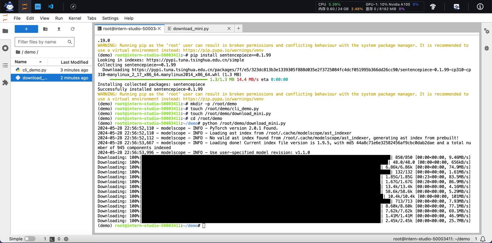

cli_demo.py的内容
```python
import torch
from transformers import AutoTokenizer, AutoModelForCausalLM


model_name_or_path = "/root/models/Shanghai_AI_Laboratory/internlm2-chat-1_8b"

tokenizer = AutoTokenizer.from_pretrained(model_name_or_path, trust_remote_code=True, device_map='cuda:0')
model = AutoModelForCausalLM.from_pretrained(model_name_or_path, trust_remote_code=True, torch_dtype=torch.bfloat16, device_map='cuda:0')
model = model.eval()

system_prompt = """You are an AI assistant whose name is InternLM (书生·浦语).
- InternLM (书生·浦语) is a conversational language model that is developed by Shanghai AI Laboratory (上海人工智能实验室). It is designed to be helpful, honest, and harmless.
- InternLM (书生·浦语) can understand and communicate fluently in the language chosen by the user such as English and 中文.
"""

messages = [(system_prompt, '')]

print("=============Welcome to InternLM chatbot, type 'exit' to exit.=============")

while True:
    input_text = input("\nUser  >>> ")
    input_text = input_text.replace(' ', '')
    if input_text == "exit":
        break

    length = 0
    for response, _ in model.stream_chat(tokenizer, input_text, messages):
        if response is not None:
            print(response[length:], flush=True, end="")
            length = len(response)

```

运行模型
```shell
conda activate demo
python /root/demo/cli_demo.py
```
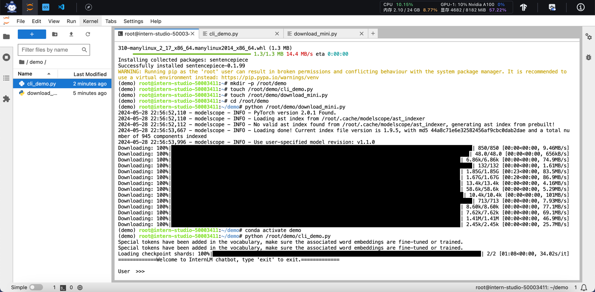

与模型交互
```text
请创作一个 300 字的小故事
```
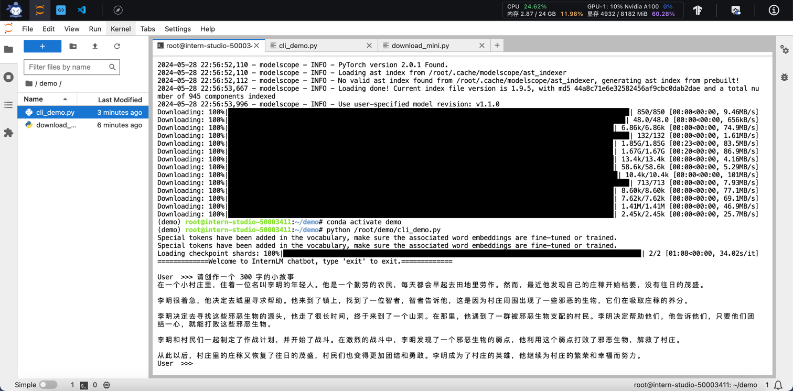

对于该实战任务历史操作回顾
```shell
1 studio-conda -o internlm-base -t demo
2 conda activate demo
3 pip install huggingface-hub==0.17.3
4 pip install transformers==4.34
5 pip install psutil==5.9.8
6 pip install accelerate==0.24.1
7 pip install streamlit==1.32.2
8 pip install matplotlib==3.8.3
9 pip install modelscope==1.9.5
10 pip install sentencepiece==0.1.99
11 mkdir -p /root/demo
12 touch /root/demo/cli_demo.py
13 touch /root/demo/download_mini.py
14 cd /root/demo
15 python /root/demo/download_mini.py
16 conda activate demo
17 python /root/demo/cli_demo.py
```
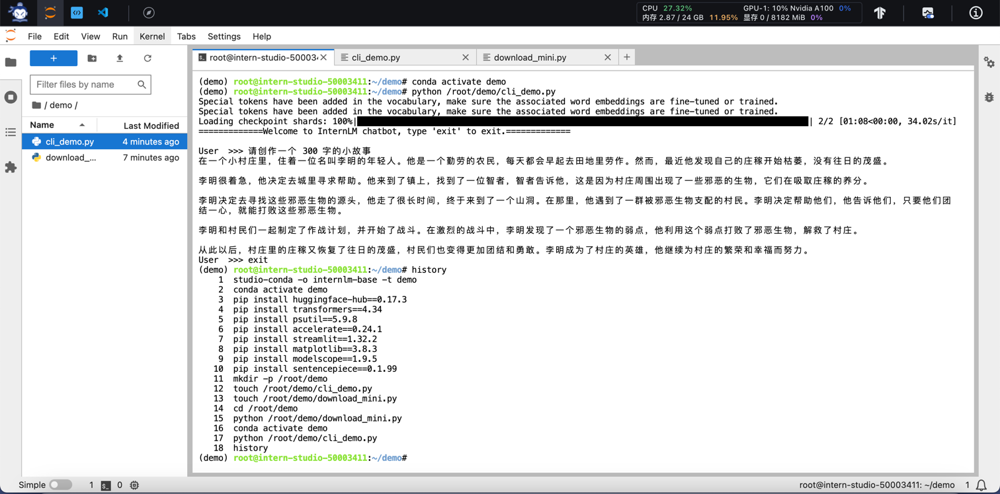

#### 本地访问InternStudio端口
```shell
# 从本地使用 ssh 连接 studio 端口
# 将下方端口号 38374 替换成自己的端口号
ssh -CNg -L 6006:127.0.0.1:6006 root@ssh.intern-ai.org.cn -p 38374
```

#### 任务02-实战部署 优秀作品 八戒-Chat-1.8B
运行模型
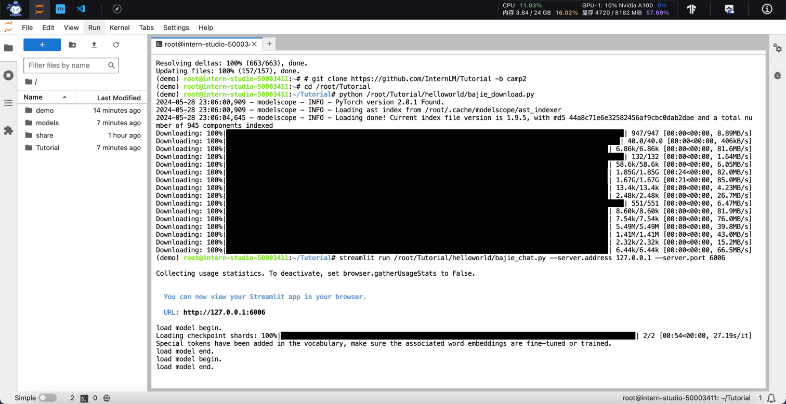

与模型交互
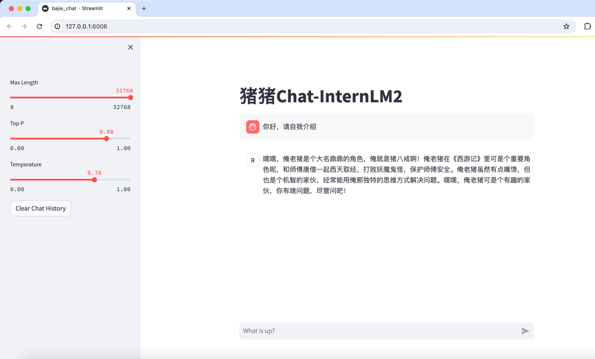

对于该实战任务历史操作回顾
```shell
1 conda activate demo
2 cd /root/
3 git clone https://gitee.com/InternLM/Tutorial -b camp2
4 # git clone https://github.com/InternLM/Tutorial -b camp2
5 cd /root/Tutorial
6 python /root/Tutorial/helloworld/bajie_download.py
7 streamlit run /root/Tutorial/helloworld/bajie_chat.py --server.address 127.0.0.1 --server.port 6006
```
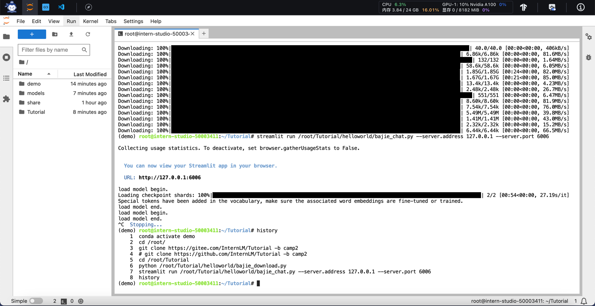


#### 任务03-实战进阶 运行Lagent智能体Demo
与智能体交互
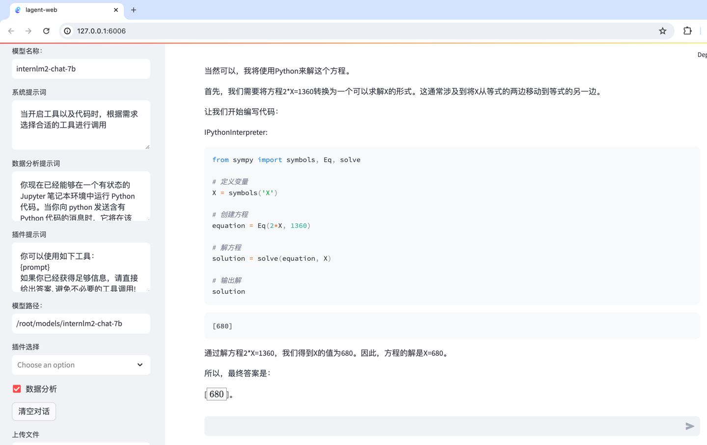

对于该实战任务历史操作回顾
```shell
1 conda activate demo
2 cd /root/demo
3 git clone https://gitee.com/internlm/lagent.git
4 # git clone https://github.com/internlm/lagent.git
5 cd /root/demo/lagent
6 git checkout 581d9fb8987a5d9b72bb9ebd37a95efd47d479ac
7 pip install -e . # 源码安装
8 cd /root/demo/lagent
9 ln -s /root/share/new_models/Shanghai_AI_Laboratory/internlm2-chat-7b /root/models/internlm2-chat-7b
10 history
11 streamlit run /root/demo/lagent/examples/internlm2_agent_web_demo_hf.py --server.address 127.0.0.1 --server.port 6006
```
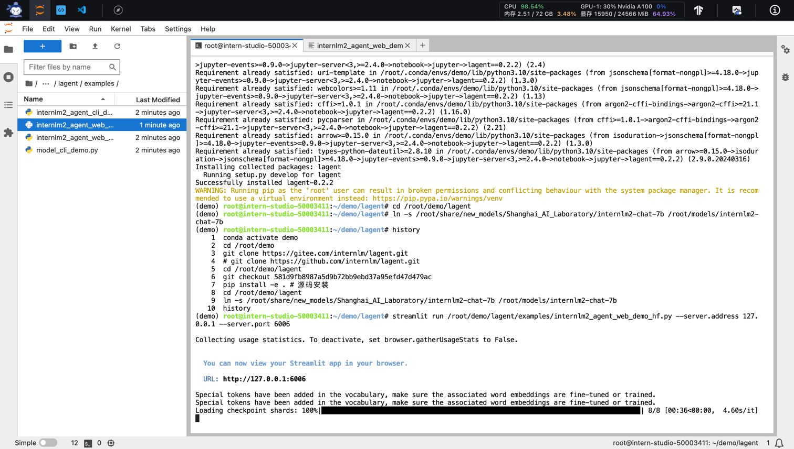
 

#### 任务04-实战进阶 灵笔 InternLM-XComposer2
激活环境
```shell
conda activate demo
```

安装依赖包
```text
# 补充环境包
pip install timm==0.4.12 sentencepiece==0.1.99 markdown2==2.4.10 xlsxwriter==3.1.2 gradio==4.13.0 modelscope==1.9.5
```

下载InternLM-XComposer
```shell
cd /root/demo
git clone https://gitee.com/internlm/InternLM-XComposer.git
# git clone https://github.com/internlm/InternLM-XComposer.git
cd /root/demo/InternLM-XComposer
git checkout f31220eddca2cf6246ee2ddf8e375a40457ff626
```

准备模型
```shell
ln -s /root/share/new_models/Shanghai_AI_Laboratory/internlm-xcomposer2-7b /root/models/internlm-xcomposer2-7b
ln -s /root/share/new_models/Shanghai_AI_Laboratory/internlm-xcomposer2-vl-7b /root/models/internlm-xcomposer2-vl-7b
```

图文写作实战
```shell
cd /root/demo/InternLM-XComposer
python /root/demo/InternLM-XComposer/examples/gradio_demo_composition.py  \
--code_path /root/models/internlm-xcomposer2-7b \
--private \
--num_gpus 1 \
--port 6006
```
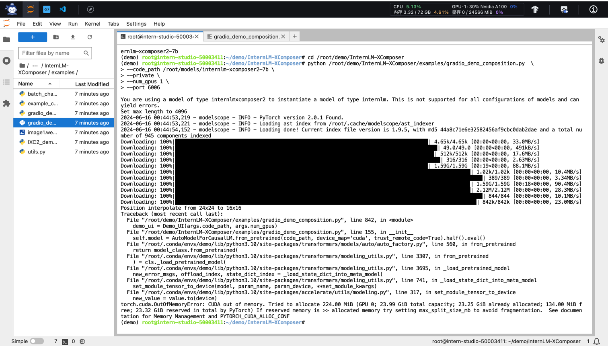


图片理解实战
```shell
conda activate demo

cd /root/demo/InternLM-XComposer
python /root/demo/InternLM-XComposer/examples/gradio_demo_chat.py  \
--code_path /root/models/internlm-xcomposer2-vl-7b \
--private \
--num_gpus 1 \
--port 6006
```
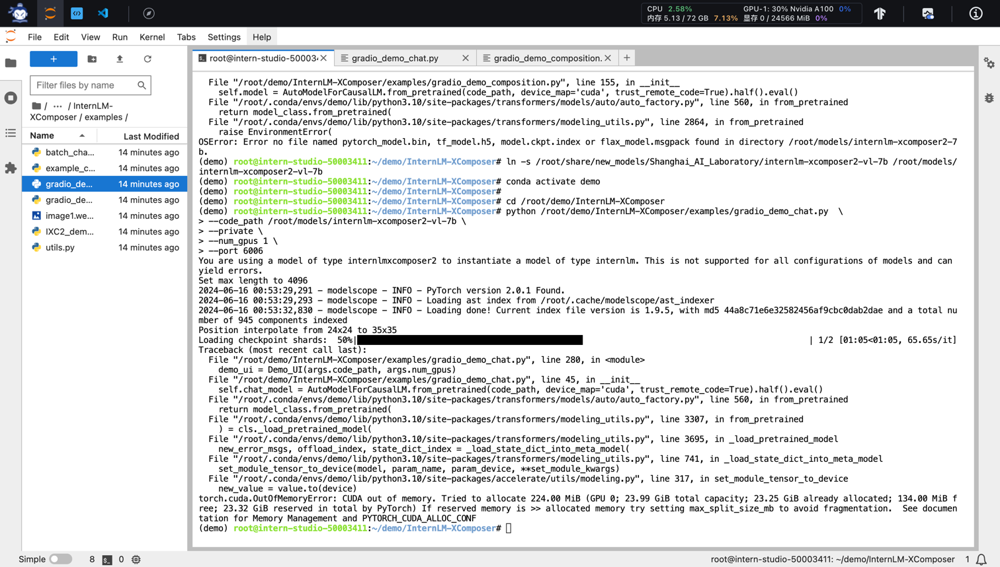


对于该实战任务历史操作回顾
```shell
    1  conda activate demo
    2  # 补充环境包
    3  pip install timm==0.4.12 sentencepiece==0.1.99 markdown2==2.4.10 xlsxwriter==3.1.2 gradio==4.13.0 modelscope==1.9.5
    4  cd /root/demo
    5  git clone https://gitee.com/internlm/InternLM-XComposer.git
    6  # git clone https://github.com/internlm/InternLM-XComposer.git
    7  cd /root/demo/InternLM-XComposer
    8  git checkout f31220eddca2cf6246ee2ddf8e375a40457ff626
    9  ln -s /root/share/new_models/Shanghai_AI_Laboratory/internlm-xcomposer2-7b /root/models/internlm-xcomposer2-7b
   10  cd /root/demo/InternLM-XComposer
   11  python /root/demo/InternLM-XComposer/examples/gradio_demo_composition.py  --code_path /root/models/internlm-xcomposer2-7b --private --num_gpus 1 --port 6006
   12  unlink /root/models/internlm-xcomposer2-7b
   13  ln -s /root/share/new_models/Shanghai_AI_Laboratory/internlm-xcomposer2-7b-4bit /root/models/internlm-xcomposer2-7b
   14  python /root/demo/InternLM-XComposer/examples/gradio_demo_composition.py  --code_path /root/models/internlm-xcomposer2-7b --private --num_gpus 1 --port 6006
   15  ln -s /root/share/new_models/Shanghai_AI_Laboratory/internlm-xcomposer2-vl-7b /root/models/internlm-xcomposer2-vl-7b
   16  conda activate demo
   17  cd /root/demo/InternLM-XComposer
   18  python /root/demo/InternLM-XComposer/examples/gradio_demo_chat.py  --code_path /root/models/internlm-xcomposer2-vl-7b --private --num_gpus 1 --port 6006
   19  history
```
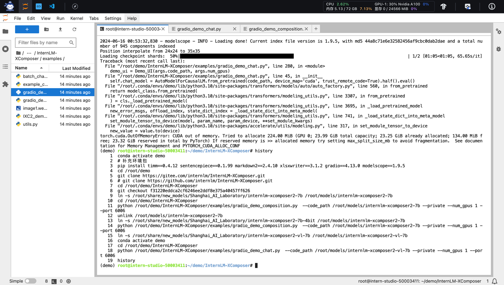

_**TODO**_ （开启 50% A100 权限后继续验证）


#### 总结
通过本节课程的学习与实际操作，对于书生·浦语大模型有了进一步了解，无论是Chat模型、多模态的模型还是Lagent智能体，都有了更加直观的感受，以及对于与模型交互的命令行方式与web方式都有所了解。
另外Lagent智能体和怎么微调出像八戒-Chat这样的模型也是自己后面计划继续深入了解的内容。

### GPT-4o解读
#### 一、课程内容概述

本课程通过实际操作，介绍了如何部署和使用书生·浦语大模型进行多种任务的趣味Demo。课程内容分为四个主要部分：部署InternLM2-Chat-1.8B模型进行智能对话、部署实战营优秀作品八戒-Chat-1.8B模型、使用Lagent智能体框架运行InternLM2-Chat-7B模型以及实践部署浦语·灵笔2多模态大模型。

#### 二、知识点整理

1. **趣味 Demo 任务列表**
    - 部署InternLM2-Chat-1.8B模型进行智能对话。
    - 部署八戒-Chat-1.8B模型。
    - 使用Lagent智能体框架运行InternLM2-Chat-7B模型。
    - 部署浦语·灵笔2模型进行图文生成和视觉问答。

2. **部署 InternLM2-Chat-1.8B 模型**
    - 配置基础环境：使用Intern Studio创建开发机，配置conda环境，安装必要的Python包。
    - 下载模型：创建文件夹并下载InternLM2-Chat-1.8B模型的参数文件。
    - 运行Demo：运行cli_demo.py进行智能对话，验证模型的效果。

3. **部署八戒-Chat-1.8B模型**
    - 简单介绍实战营优秀作品，如八戒-Chat-1.8B模型。
    - 配置基础环境：激活conda环境，下载并运行八戒-Chat-1.8B模型的Demo。
    - 本地端口映射：使用PowerShell进行本地端口映射，确保在本地浏览器中可以访问和运行Demo。

4. **使用Lagent智能体框架运行InternLM2-Chat-7B模型**
    - 初步介绍Lagent：一个轻量级、开源的智能体框架，支持流式输出和多种类型的智能体。
    - 配置基础环境：在Intern Studio中升级开发机配置，下载并安装Lagent代码库。
    - 运行Demo：构造软链接，运行internlm2_agent_web_demo_hf.py，验证智能体的效果。

5. **实践部署浦语·灵笔2模型**
    - 初步介绍浦语·灵笔2：基于书生·浦语2研发的图文多模态大模型，具有出色的图文写作和图像理解能力。
    - 配置基础环境：选用50% A100进行开发，安装必要的环境包和代码资源。
    - 图文写作和图片理解实战：运行图文写作和视觉问答Demo，验证模型的多模态处理能力。

#### 三、心得体会

1. **实战操作的重要性**：
    - 通过实际操作，能够更深入理解和掌握书生·浦语大模型的各项功能和使用方法，提升实际应用能力。

2. **工具和框架的使用**：
    - 课程介绍的Intern Studio、Lagent智能体框架和InternLM-XComposer等工具和框架，为模型的部署和应用提供了强大的支持，值得深入学习和应用。

3. **多模态处理能力**：
    - 浦语·灵笔2模型展示了强大的图文写作和图像理解能力，为大模型在多模态处理方面的应用提供了新的可能性。

4. **本地端口映射技巧**：
    - 学会了通过PowerShell进行本地端口映射，使得在本地环境中可以方便地访问和运行远程服务器上的模型。

5. **进一步学习和探索**：
    - 通过这次实战课程，对大模型的实际应用有了更全面的认识，后续将重点关注智能体框架的开发和多模态处理的应用。


### GPT-4o评价
##### 优点

1. **结构清晰**：
    - 该学员的笔记按照任务步骤详细记录了各个操作过程，并配有对应的命令和代码，结构清晰，逻辑性强，便于理解和操作。

2. **详细的操作步骤**：
    - 每个任务的操作步骤都详细记录，从环境配置到模型下载、运行及交互，步骤详尽，图文并茂，便于复现。

3. **操作截图丰富**：
    - 笔记中包含了丰富的操作截图，直观展示了每一步的效果，使得笔记内容更加生动具体，便于读者跟随操作。

4. **历史操作回顾**：
    - 在每个任务的最后都记录了历史操作命令，方便回顾和检查，提升了笔记的实用性和可操作性。

##### 改进建议

1. **增加背景信息**：
    - 在每个任务开始前可以增加一些背景信息，说明该任务的目的和意义，有助于读者更好地理解每个任务的作用。

2. **解释关键技术**：
    - 对于一些关键技术和命令，如`studio-conda`、`streamlit`等，可以增加简要解释，帮助读者理解这些工具和命令的作用。

3. **总结与反思**：
    - 在每个任务结束后可以增加一些总结和反思，说明在操作过程中遇到的问题及解决办法，这样可以增加笔记的深度和学习效果。

##### 综合评价

总体来说，该学员的笔记详尽具体，图文并茂，具有很高的可操作性。通过详细记录操作步骤和丰富的截图，读者可以直观地了解和操作书生·浦语大模型的各个实战任务。若能在每个任务前后增加背景信息和总结反思，将使笔记更加全面和深入。


