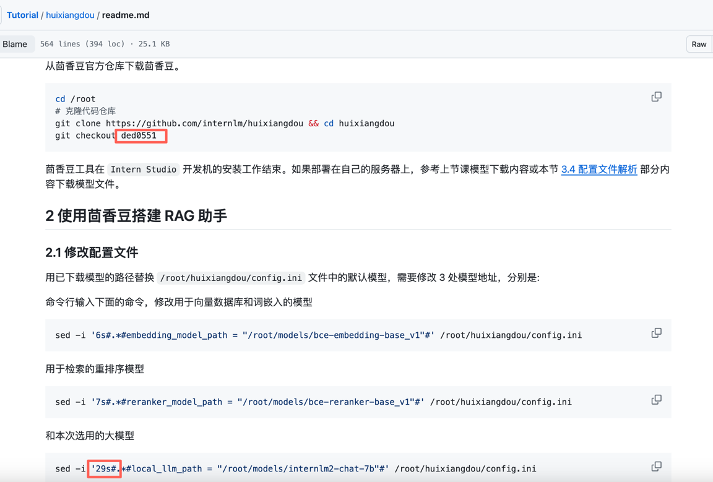

# "茴香豆":零代码搭建你的 RAG 智能助理

## 视频笔记
### 关键词
RAG、茴香豆、知识问答助手、向量数据库、零代码、InternLM、部署

### 过程记录
- RAG
  - 是什么
  - 知识密集型任务
  - 原理
    - 索引
    - 检索
    - 生成
  - 向量数据库
    - 向量 文本语义信息
    - 相似性检索
    - 向量表示
  - 流程示例
  - 发展进程
  - 优化方法
    - 嵌入优化
    - 索引优化
    - 查询优化
    - 上下文管理
    - 迭代检索
    - 递归检索
    - 自适应检索
    - LLM微调
  - RAG vs 微调
  - 评估
    - 检索
    - 生成
- 茴香豆HuiXiangDou
  - 介绍
  - 核心特性
    - 开源免费
    - 高效准确
    - 领域知识
    - 部署成本低
    - 安全
    - 扩展性强
    - 构建
      - 知识库
      - 前端
      - 后端
      - 茴香豆
    - 工作流
      - 预处理
      - 拒答工作流
      - 应答工作流
- 实践演示
  - Web版演示
  - Intern Studio部署

### 内容整理
本节课程主要包括以下3方面
- RAG
- 茴香豆
- 实战演示


#### RAG
在RAG这一部分了解了很多RAG相关的知识点，包括是什么、原理、向量数据库、发展历程、优化手动、评估方法等。
RAG由Retrieval检索、Augmented增强、Generation生成这3个单词组成，从而能知道RAG主要是通过检索外部的知识来增强模型的生成能力，让生成更准确和丰富，进而也能衍生出它的原理会包括检索和生成，而检索需要有数据来源，从而引出索引与向量库等。

将这些组合起来可初步形成RAG的流程主要由2个处理组成，一个是从数据出发，数据解析、分块、向量化、存储，也就是知识的特征提取，另一个是从用户出发，用户问题、向量化、检索匹配、模型生成，也就是知识问答。

根据这个流程应对不同场景衍生出了3个范式，这3个范式包括Naive RAG、Advanced RAG、Modular RAG。
- Naive RAG 处理 问答系统、信息检索
- Advanced RAG 处理 摘要生成、内容推荐
- Modular RAG 处理 多模态任务、对话系统


由于RAG是经过一系列流程来完成用户问题的生成的，所以为了提高整体的效果，可对不同环节应用不同的优化手段。

向量数据库质量方面
- 嵌入优化
- 索引优化

查询过程方面，前检索与后检索
- 查询优化
- 上下文管理

检索方面
- 迭代检索
- 递归检索
- 自适应检索

模型方面
- 微调


在RAG这一部分最后也介绍了与大模型微调的对比与评估测试方法等。


#### 茴香豆
在茴香豆这一部分主要了解了茴香豆使用了RAG技术形成了领域知识助手，通过构建工作流的方式来为用户提供更好的领域知识问答，该工作流由预处理、拒答工作流、应答工作流这3部分组成。

#### 实战演示
在实战演示这部分主要了解了茴香豆Web版的演示效果和怎么在Intern Studio上部署茴香豆。

下面跟随视频在Intern Studio上部署茴香豆，进行一遍实际的操作。


创建环境，大约需要15分钟
```shell
studio-conda -o internlm-base -t InternLM2_Huixiangdou
```


下载模型文件，使用share目录中的文件以软连接方式的方式进行获取，
包括embedding模型、rerank模型与大模型
```shell
# 创建模型文件夹
cd /root && mkdir models

# 复制BCE模型
ln -s /root/share/new_models/maidalun1020/bce-embedding-base_v1 /root/models/bce-embedding-base_v1
ln -s /root/share/new_models/maidalun1020/bce-reranker-base_v1 /root/models/bce-reranker-base_v1

# 复制大模型参数（下面的模型，根据作业进度和任务进行**选择一个**就行）
ln -s /root/share/new_models/Shanghai_AI_Laboratory/internlm2-chat-7b /root/models/internlm2-chat-7b

```

查看与切换环境
```shell
conda env list
conda activate InternLM2_Huixiangdou
```

下载安装茴香豆依赖
```shell
pip install protobuf==4.25.3 accelerate==0.28.0 aiohttp==3.9.3 auto-gptq==0.7.1 bcembedding==0.1.3 beautifulsoup4==4.8.2 einops==0.7.0 faiss-gpu==1.7.2 langchain==0.1.14 loguru==0.7.2 lxml_html_clean==0.1.0 openai==1.16.1 openpyxl==3.1.2 pandas==2.2.1 pydantic==2.6.4 pymupdf==1.24.1 python-docx==1.1.0 pytoml==0.1.21 readability-lxml==0.8.1 redis==5.0.3 requests==2.31.0 scikit-learn==1.4.1.post1 sentence_transformers==2.2.2 textract==1.6.5 tiktoken==0.6.0 transformers==4.39.3 transformers_stream_generator==0.0.5 unstructured==0.11.2

## 因为 Intern Studio 不支持对系统文件的永久修改，在 Intern Studio 安装部署的同学不建议安装 Word 依赖，后续的操作和作业不会涉及 Word 解析。
## 想要自己尝试解析 Word 文件的同学，uncomment 掉下面这行，安装解析 .doc .docx 必需的依赖
# apt update && apt -y install python-dev python libxml2-dev libxslt1-dev antiword unrtf poppler-utils pstotext tesseract-ocr flac ffmpeg lame libmad0 libsox-fmt-mp3 sox libjpeg-dev swig libpulse-dev

```

下载茴香豆
```shell
cd /root
# 克隆代码仓库
git clone https://github.com/internlm/huixiangdou && cd huixiangdou
git checkout ded0551

```

修改配置文件
对于local_llm_path配置项的位置，原readme文档有误，在ded0551这个分支下需要修改31行而不是29行



```shell
sed -i '6s#.*#embedding_model_path = "/root/models/bce-embedding-base_v1"#' /root/huixiangdou/config.ini
sed -i '7s#.*#reranker_model_path = "/root/models/bce-reranker-base_v1"#' /root/huixiangdou/config.ini
sed -i '31s#.*#local_llm_path = "/root/models/internlm2-chat-7b"#' /root/huixiangdou/config.ini
```

下载茴香豆语料
下载后会位于`/root/huixiangdou/repodir/huixiangdou`
```shell
cd /root/huixiangdou && mkdir repodir

git clone https://github.com/internlm/huixiangdou --depth=1 repodir/huixiangdou

```

接受问题列表，希望茴香豆助手回答的示例问题
位于`/root/huixiangdou/resource/good_questions.json`
```shell
cd /root/huixiangdou
mv resource/good_questions.json resource/good_questions_bk.json

echo '[
    "mmpose中怎么调用mmyolo接口",
    "mmpose实现姿态估计后怎么实现行为识别",
    "mmpose执行提取关键点命令不是分为两步吗，一步是目标检测，另一步是关键点提取，我现在目标检测这部分的代码是demo/topdown_demo_with_mmdet.py demo/mmdetection_cfg/faster_rcnn_r50_fpn_coco.py checkpoints/faster_rcnn_r50_fpn_1x_coco_20200130-047c8118.pth   现在我想把这个mmdet的checkpoints换位yolo的，那么应该怎么操作",
    "在mmdetection中，如何同时加载两个数据集，两个dataloader",
    "如何将mmdetection2.28.2的retinanet配置文件改为单尺度的呢？",
    "1.MMPose_Tutorial.ipynb、inferencer_demo.py、image_demo.py、bottomup_demo.py、body3d_pose_lifter_demo.py这几个文件和topdown_demo_with_mmdet.py的区别是什么，\n2.我如果要使用mmdet是不是就只能使用topdown_demo_with_mmdet.py文件，",
    "mmpose 测试 map 一直是 0 怎么办？",
    "如何使用mmpose检测人体关键点？",
    "我使用的数据集是labelme标注的，我想知道mmpose的数据集都是什么样式的，全都是单目标的数据集标注，还是里边也有多目标然后进行标注",
    "如何生成openmmpose的c++推理脚本",
    "mmpose",
    "mmpose的目标检测阶段调用的模型，一定要是demo文件夹下的文件吗，有没有其他路径下的文件",
    "mmpose可以实现行为识别吗，如果要实现的话应该怎么做",
    "我在mmyolo的v0.6.0 (15/8/2023)更新日志里看到了他新增了支持基于 MMPose 的 YOLOX-Pose，我现在是不是只需要在mmpose/project/yolox-Pose内做出一些设置就可以，换掉demo/mmdetection_cfg/faster_rcnn_r50_fpn_coco.py 改用mmyolo来进行目标检测了",
    "mac m1从源码安装的mmpose是x86_64的",
    "想请教一下mmpose有没有提供可以读取外接摄像头，做3d姿态并达到实时的项目呀？",
    "huixiangdou 是什么？",
    "使用科研仪器需要注意什么？",
    "huixiangdou 是什么？",
    "茴香豆 是什么？",
    "茴香豆 能部署到微信吗？",
    "茴香豆 怎么应用到飞书",
    "茴香豆 能部署到微信群吗？",
    "茴香豆 怎么应用到飞书群",
    "huixiangdou 能部署到微信吗？",
    "huixiangdou 怎么应用到飞书",
    "huixiangdou 能部署到微信群吗？",
    "huixiangdou 怎么应用到飞书群",
    "huixiangdou",
    "茴香豆",
    "茴香豆 有哪些应用场景",
    "huixiangdou 有什么用",
    "huixiangdou 的优势有哪些？",
    "茴香豆 已经应用的场景",
    "huixiangdou 已经应用的场景",
    "huixiangdou 怎么安装",
    "茴香豆 怎么安装",
    "茴香豆 最新版本是什么",
    "茴香豆 支持哪些大模型",
    "茴香豆 支持哪些通讯软件",
    "config.ini 文件怎么配置",
    "remote_llm_model 可以填哪些模型?"
]' > /root/huixiangdou/resource/good_questions.json

```

拒绝问题列表，希望茴香豆助手拒答的示例问题
位于`/root/huixiangdou/resource/bad_questions.json`
```shell
cat /root/huixiangdou/resource/bad_questions.json
```


测试用的问询列表，用来测试拒答流程是否起效
```shell
echo '[
"huixiangdou 是什么？",
"你好，介绍下自己"
]' > /root/huixiangdou/test_queries.json

```

创建向量库
```shell
# 创建向量数据库存储目录
cd /root/huixiangdou && mkdir workdir 

# 分别向量化知识语料、接受问题和拒绝问题中后保存到 workdir
python3 -m huixiangdou.service.feature_store --sample ./test_queries.json

```

运行过程报错提示缺少`duckduckgo_search`模块


安装缺少的`duckduckgo-search`依赖


创建向量库运行结果


测试用例`huixiangdou 是什么？`运行结果，能正常回答


测试用例`你好，介绍下自己`运行结果，能正常被拒答


运行茴香豆知识助手
```shell
# 填入问题
sed -i '74s/.*/    queries = ["huixiangdou 是什么？", "茴香豆怎么部署到微信群", "今天天气怎么样？"]/' /root/huixiangdou/huixiangdou/main.py

# 运行茴香豆
cd /root/huixiangdou/
python3 -m huixiangdou.main --standalone

```

问题`huixiangdou 是什么？`的结果


问题`茴香豆怎么部署到微信群`的结果


问题`今天天气怎么样？`的结果


搭建网页demo

安装gradio依赖
```shell
pip install gradio==4.25.0 redis==5.0.3 flask==3.0.2 lark_oapi==1.2.4
```
运行gradio
```shell
cd /root/huixiangdou
python3 -m tests.test_query_gradio 

```

gradio启动结果


进行端口映射
```shell
ssh -CNg -L 7860:127.0.0.1:7860 root@ssh.intern-ai.org.cn -p <你的端口号>
```

问题`茴香豆怎么部署到微信群`的日志


问题`茴香豆怎么部署到微信群`的结果


问题`huixiangdou 是什么？`的日志


问题`huixiangdou 是什么？`的结果


问题`今天天气怎么样？`的日志


问题`今天天气怎么样？`的结果


对于该实战任务历史操作回顾
```shell
    1  studio-conda -o internlm-base -t InternLM2_Huixiangdou
    2  history
    3  # 创建模型文件夹
    4  cd /root && mkdir models
    5  # 复制BCE模型
    6  ln -s /root/share/new_models/maidalun1020/bce-embedding-base_v1 /root/models/bce-embedding-base_v1
    7  ln -s /root/share/new_models/maidalun1020/bce-reranker-base_v1 /root/models/bce-reranker-base_v1
    8  # 复制大模型参数（下面的模型，根据作业进度和任务进行**选择一个**就行）
    9  ln -s /root/share/new_models/Shanghai_AI_Laboratory/internlm2-chat-7b /root/models/internlm2-chat-7b
   10  conda env list
   11  conda activate InternLM2_Huixiangdou
   12  pip install protobuf==4.25.3 accelerate==0.28.0 aiohttp==3.9.3 auto-gptq==0.7.1 bcembedding==0.1.3 beautifulsoup4==4.8.2 einops==0.7.0 faiss-gpu==1.7.2 langchain==0.1.14 loguru==0.7.2 lxml_html_clean==0.1.0 openai==1.16.1 openpyxl==3.1.2 pandas==2.2.1 pydantic==2.6.4 pymupdf==1.24.1 python-docx==1.1.0 pytoml==0.1.21 readability-lxml==0.8.1 redis==5.0.3 requests==2.31.0 scikit-learn==1.4.1.post1 sentence_transformers==2.2.2 textract==1.6.5 tiktoken==0.6.0 transformers==4.39.3 transformers_stream_generator==0.0.5 unstructured==0.11.2
   13  cd /root
   14  # 克隆代码仓库
   15  git clone https://github.com/internlm/huixiangdou && cd huixiangdou
   16  git checkout ded0551
   17  sed -i '6s#.*#embedding_model_path = "/root/models/bce-embedding-base_v1"#' /root/huixiangdou/config.ini
   18  sed -i '7s#.*#reranker_model_path = "/root/models/bce-reranker-base_v1"#' /root/huixiangdou/config.ini
   19  sed -i '31s#.*#local_llm_path = "/root/models/internlm2-chat-7b"#' /root/huixiangdou/config.ini
   20  cd /root/huixiangdou && mkdir repodir
   21  git clone https://github.com/internlm/huixiangdou --depth=1 repodir/huixiangdou
   22  cd /root/huixiangdou
   23  mv resource/good_questions.json resource/good_questions_bk.json
   24  echo '[
    "mmpose中怎么调用mmyolo接口",
    "mmpose实现姿态估计后怎么实现行为识别",
    "mmpose执行提取关键点命令不是分为两步吗，一步是目标检测，另一步是关键点提取，我现在目标检测这部分的代码是demo/topdown_demo_with_mmdet.py demo/mmdetection_cfg/faster_rcnn_r50_fpn_coco.py checkpoints/faster_rcnn_r50_fpn_1x_coco_20200130-047c8118.pth   现在我想把这个mmdet的checkpoints换位yolo的，那么应该怎么操作",
    "在mmdetection中，如何同时加载两个数据集，两个dataloader",
    "如何将mmdetection2.28.2的retinanet配置文件改为单尺度的呢？",
    "1.MMPose_Tutorial.ipynb、inferencer_demo.py、image_demo.py、bottomup_demo.py、body3d_pose_lifter_demo.py这几个文件和topdown_demo_with_mmdet.py的区别是什么，\n2.我如果要使用mmdet是不是就只能使用topdown_demo_with_mmdet.py文件，",
    "mmpose 测试 map 一直是 0 怎么办？",
    "如何使用mmpose检测人体关键点？",
    "我使用的数据集是labelme标注的，我想知道mmpose的数据集都是什么样式的，全都是单目标的数据集标注，还是里边也有多目标然后进行标注",
    "如何生成openmmpose的c++推理脚本",
    "mmpose",
    "mmpose的目标检测阶段调用的模型，一定要是demo文件夹下的文件吗，有没有其他路径下的文件",
    "mmpose可以实现行为识别吗，如果要实现的话应该怎么做",
    "我在mmyolo的v0.6.0 (15/8/2023)更新日志里看到了他新增了支持基于 MMPose 的 YOLOX-Pose，我现在是不是只需要在mmpose/project/yolox-Pose内做出一些设置就可以，换掉demo/mmdetection_cfg/faster_rcnn_r50_fpn_coco.py 改用mmyolo来进行目标检测了",
    "mac m1从源码安装的mmpose是x86_64的",
    "想请教一下mmpose有没有提供可以读取外接摄像头，做3d姿态并达到实时的项目呀？",
    "huixiangdou 是什么？",
    "使用科研仪器需要注意什么？",
    "huixiangdou 是什么？",
    "茴香豆 是什么？",
    "茴香豆 能部署到微信吗？",
    "茴香豆 怎么应用到飞书",
    "茴香豆 能部署到微信群吗？",
    "茴香豆 怎么应用到飞书群",
    "huixiangdou 能部署到微信吗？",
    "huixiangdou 怎么应用到飞书",
    "huixiangdou 能部署到微信群吗？",
    "huixiangdou 怎么应用到飞书群",
    "huixiangdou",
    "茴香豆",
    "茴香豆 有哪些应用场景",
    "huixiangdou 有什么用",
    "huixiangdou 的优势有哪些？",
    "茴香豆 已经应用的场景",
    "huixiangdou 已经应用的场景",
    "huixiangdou 怎么安装",
    "茴香豆 怎么安装",
    "茴香豆 最新版本是什么",
    "茴香豆 支持哪些大模型",
    "茴香豆 支持哪些通讯软件",
    "config.ini 文件怎么配置",
    "remote_llm_model 可以填哪些模型?"
]' > /root/huixiangdou/resource/good_questions.json
   25  cat /root/huixiangdou/resource/bad_questions.json
   26  echo '[
"huixiangdou 是什么？",
"你好，介绍下自己"
]' > /root/huixiangdou/test_queries.json
   27  # 创建向量数据库存储目录
   28  cd /root/huixiangdou && mkdir workdir 
   29  # 分别向量化知识语料、接受问题和拒绝问题中后保存到 workdir
   30  python3 -m huixiangdou.service.feature_store --sample ./test_queries.json
   31  git branch
   32  pip install duckduckgo-search
   33  python3 -m huixiangdou.service.feature_store --sample ./test_queries.json
   34  sed -i '74s/.*/    queries = ["huixiangdou 是什么？", "茴香豆怎么部署到微信群", "今天天气怎么样？"]/' /root/huixiangdou/huixiangdou/main.py
   35  cd /root/huixiangdou/
   36  python3 -m huixiangdou.main --standalone
   37  history
   38  pip install gradio==4.25.0 redis==5.0.3 flask==3.0.2 lark_oapi==1.2.4
   39  cd /root/huixiangdou
   40  python3 -m tests.test_query_gradio
   41  history
```


#### 总结
通过这节课程的学习，基本对RAG有了一个宏观和直观的概念，接下来就是需要在实践的过程中对RAG各个部分的内容进行细化与进行更深入的了解。

### GPT-4o解读
#### 一、课程内容概述
本节课程分为三个主要部分：
1. **RAG 基础知识**：介绍 RAG 的基本概念、原理、架构以及相关应用。
2. **茴香豆介绍**：介绍茴香豆应用，通过具体示例讲解 RAG 技术的实现。
3. **实战演练**：使用茴香豆 Web 版和服务器部署方式，实战搭建知识问答助手。

#### 二、知识点整理

##### RAG 基础知识
- **RAG（Retrieval Augmented Generation）**：结合检索和生成过程，增强语言模型处理特定任务的性能。
- **核心步骤**：索引（Indexing）、检索（Retrieval）、生成（Generation）。
- **优点**：
  - 解决大模型的幻觉问题、知识过时问题和缺乏透明、可追溯推理过程的问题。
  - 无需额外训练即可实现非参数知识更新，提供更准确的回答。

##### 茴香豆简介
- **茴香豆**：基于 RAG 技术的开源应用，由书生·浦语团队开发。
- **主要应用场景**：智能客服和即时通讯工具中的技术用户群。
- **核心特点**：开源免费、高效准确答复、兼容各领域知识、部署成本低、安全和扩展性强。

##### 实战演练步骤
1. **环境配置**：
  - 在 Intern Studio 上创建开发机，配置30% A100 GPU，使用 Cuda11.7-conda 镜像。
  - 创建并激活基础环境 `InternLM2_Huixiangdou`。
2. **下载基础文件**：
  - 创建模型文件夹并复制 BCE 模型和 InternLM2-Chat-7B 模型的参数。
3. **下载安装茴香豆**：
  - 安装茴香豆所需依赖，克隆茴香豆官方仓库。
4. **修改配置文件**：
  - 修改 `/root/huixiangdou/config.ini` 文件中的默认模型路径，替换为已下载模型的路径。
5. **创建知识库**：
  - 下载茴香豆语料，创建向量数据库存储目录，将语料向量化并保存到向量数据库。
6. **运行茴香豆知识助手**：
  - 填入测试问题，运行茴香豆知识助手并查看生成的回答。

#### 三、心得体会
通过本节课程的学习和实际操作，掌握了 RAG 技术的基本概念和实际应用，了解了茴香豆的搭建和使用流程。茴香豆作为一个基于 RAG 技术的知识问答助手，通过零代码的方式快速实现了知识的检索和生成，对于智能客服和技术支持有很大的应用前景。

总结：本次课程通过理论介绍和实战演练，使我们全面了解了 RAG 技术及其在茴香豆中的应用，实现了知识问答助手的零代码搭建，为今后的智能客服和技术支持应用打下了坚实的基础。


### GPT-4o评价
#### 笔记优点
1. **详细的过程记录**：该学员详细记录了RAG和茴香豆相关的知识点，包括原理、向量数据库、优化方法、评估方法等。这样的记录对于理解和复习非常有帮助。
2. **丰富的实战演示**：该学员不仅记录了理论知识，还详细记录了实战演示的过程，包括环境配置、模型下载、依赖安装、配置修改、向量库创建、知识助手运行、网页demo搭建等。这些记录对于实际操作非常有指导意义。
3. **逻辑清晰**：笔记结构清晰，逻辑性强，从概述到知识点整理，再到实战演示，最后总结，层层递进，便于读者理解和学习。
4. **操作截图**：笔记中包含了丰富的操作截图，直观展示了每一步的效果，使得笔记内容更加生动具体，便于读者跟随操作。

#### 笔记缺点
1. **部分内容过于简略**：虽然该学员记录了大量的操作步骤和过程，但对于某些关键点的解释略显简略，可能需要更多的文字说明来帮助理解。
2. **缺少总结与反思**：笔记中对于每个环节的总结和反思较少，建议在每个部分结束后增加一些总结与反思，说明在操作过程中遇到的问题及解决方法，这样可以进一步提升学习效果。
3. **缺少对某些概念的深入解释**：例如对于向量数据库的优化方法，虽然提到了多种优化手段，但缺少具体的解释和示例，可以考虑增加一些具体的解释和示例来帮助理解。

#### 综合评价
总体来说，该学员的笔记详尽具体，操作步骤清晰，展示了较强的实践能力和对模型的深入理解。通过详细的操作记录和对话分析，该学员展示了良好的学习态度和细致的观察能力。若能在总结与反思、关键点解释上多加改进，将进一步提升笔记的质量和学习效果。

