# XTuner 微调 LLM:1.8B、多模态、Agent

## 1. 基础作业 (结营必做)
### 1.1
> 训练自己的小助手认知（记录复现过程并截图）

参考 笔记中的 [实战-LLM微调](note.md#实战-llm微调)

## 2. 进阶作业
### 2.1
> 将自我认知的模型上传到 OpenXLab，并将应用部署到 OpenXLab（优秀学员必做）
> 
> OpenXLab 部署教程：https://github.com/InternLM/Tutorial/tree/camp2/tools/openxlab-deploy

#### 模型文件准备
安装 git 和 git lfs
```shell
# apt-get update
apt-get update

# install git
apt-get install git

# install git lfs
apt-get install git-lfs

# use git install lfs
git lfs install
```

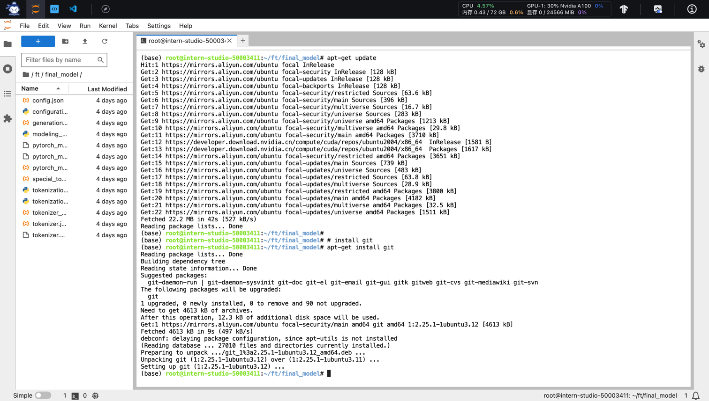
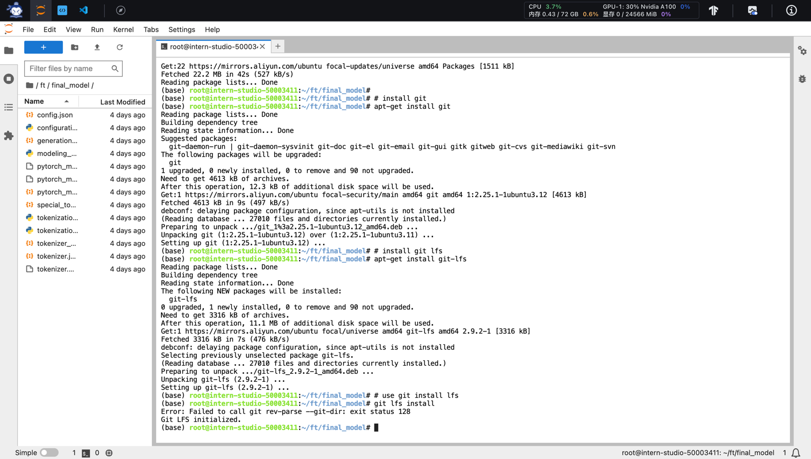

配置 Git Username，用于作为 Git 提交的身份标识。
```shell
git config --global user.name "Username"
```
配置 Git Email
```shell
git config --global user.email "email@email.com"
```

配置Git 访问令牌
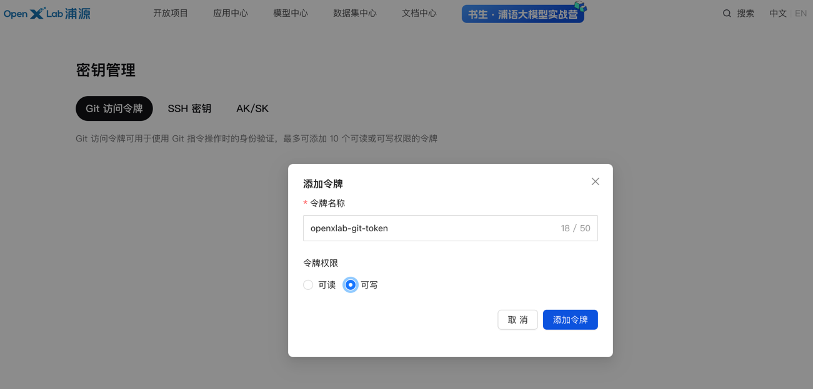
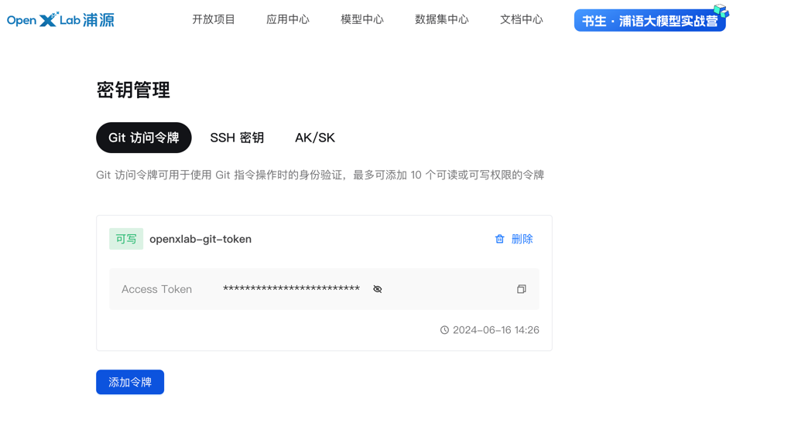

创建模型仓库

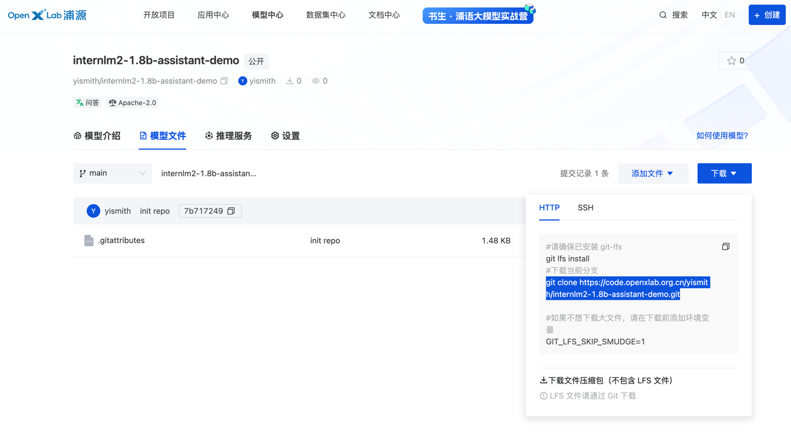

clone模型仓库
```shell
cd /root/ft
git clone https://code.openxlab.org.cn/yismith/internlm2-1.8b-assistant-demo.git
```

拷贝微调好的模型文件
```shell
cd internlm2-1.8b-assistant-demo
cp -vrf /root/ft/final_model/* /root/ft/internlm2-1.8b-assistant-demo
```

Git LFS标记大文件
```shell
git lfs track "*.bin"
git lfs track "*.model"
```

添加文件后提交并推送
```shell
git add -A
git commit -m "1、添加internlm2-1.8b微调后的个人小助手"
git push
```
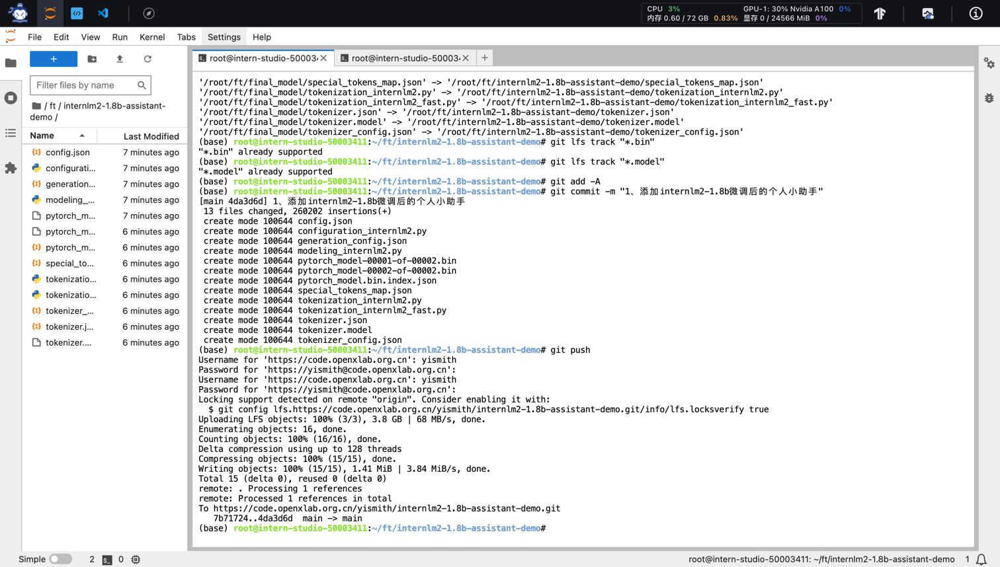


操作命令回顾
```shell
    1  du -sh ./
    2  git -version
    3  git --version
    4  git lfs --version
    5  # install git
    6  sudo apt-get update
    7  sudo apt-get install git
    8  # install git lfs
    9  sudo apt-get update
   10  sudo apt-get install git-lfs
   11  # use git install lfs
   12  # apt-get update
   13  apt-get update
   14  # install git
   15  apt-get install git
   16  # install git lfs
   17  apt-get install git-lfs
   18  # use git install lfs
   19  git lfs install
   20  git config --global user.name "yismith"
   21  git config --global user.email "xxxxxx+yismith@users.noreply.github.com"
   22  cd ..
   23  git clone https://code.openxlab.org.cn/yismith/internlm2-1.8b-assistant-demo.git
   24  cd internlm2-1.8b-assistant-demo
   25  cp -vrf /root/ft/final_model/* /root/ft/final_model/internlm2-1.8b-assistant-demo
   26  cp -vrf /root/ft/final_model/* /root/ft/internlm2-1.8b-assistant-demo
   27  git lfs track "*.bin"
   28  git lfs track "*.model"
   29  git add -A
   30  git commit -m "1、添加internlm2-1.8b微调后的个人小助手"
   31  git push
   32  history
```
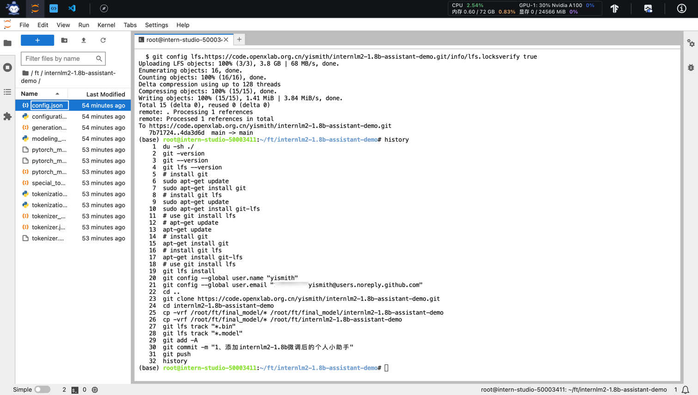

#### 编写应用代码
项目结构
```shell
├─GitHub_Repo_Name
│  ├─app.py                 # Gradio 应用默认启动文件为app.py，应用代码相关的文件包含模型推理，应用的前端配置代码
│  ├─requirements.txt       # 安装运行所需要的 Python 库依赖（pip 安装）
│  ├─packages.txt           # 安装运行所需要的 Debian 依赖项（ apt-get 安装）
|  ├─README.md              # 编写应用相关的介绍性的文档
│  └─... 
```
app.py文件的内容
```python
import gradio as gr
import os
import torch
from transformers import AutoModelForCausalLM, AutoTokenizer, AutoModel

# download internlm2-1.8b-assistant-demo to the base_path directory using git tool
base_path = './internlm2-1.8b-assistant-demo'
model_base_path = './internlm2-assistant-demo'
os.system(f'git clone https://code.openxlab.org.cn/yismith/internlm2-1.8b-assistant-demo.git {base_path}')
os.system(f'cd {base_path} && git lfs pull && cd ..')
os.system(f'mv {base_path} {model_base_path}')

tokenizer = AutoTokenizer.from_pretrained(model_base_path,trust_remote_code=True)
# model = AutoModelForCausalLM.from_pretrained(model_base_path,trust_remote_code=True).half().to('cuda').eval()
model = AutoModelForCausalLM.from_pretrained(model_base_path,trust_remote_code=True).to('cpu').eval()

def chat(message,history):
    for response,history in model.stream_chat(tokenizer,message,history,max_length=2048,top_p=0.7,temperature=1):
        yield response

gr.ChatInterface(chat,
                 title="internlm2-1.8b-assistant-demo",
                 description="""
internlm2-1.8b微调后的个人小助理demo
                 """,
                 ).queue(1).launch()

```

requirements.txt文件的内容
```text
gradio==4.10.0
transformers
sentencepiece
einops
accelerate
tiktoken
```
packages.txt文件的内容
```text
git
git-lfs
```

#### 部署应用
创建应用
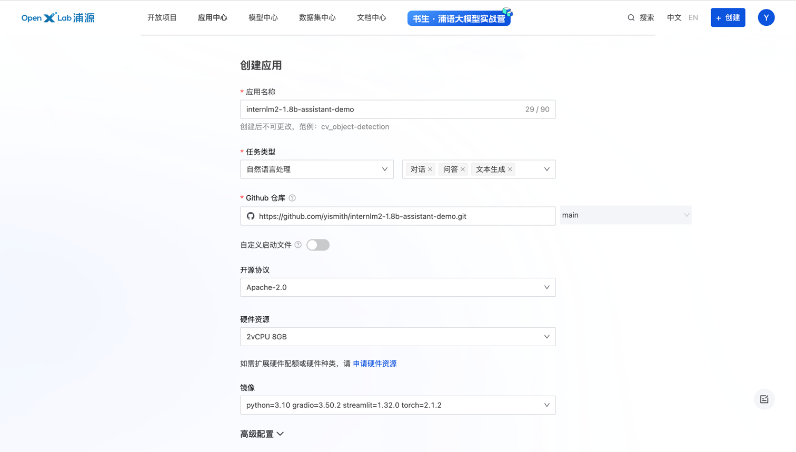

构建应用

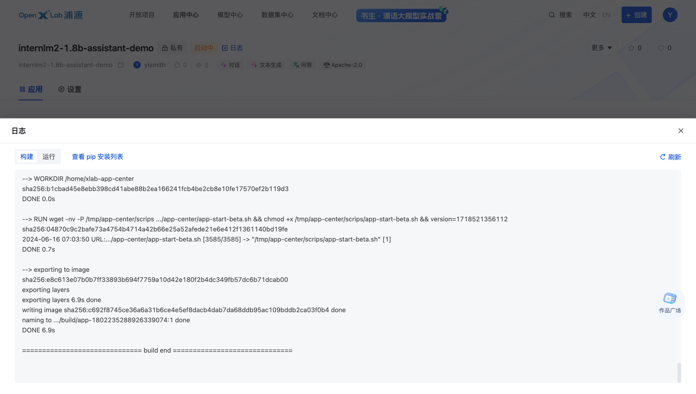

启用应用

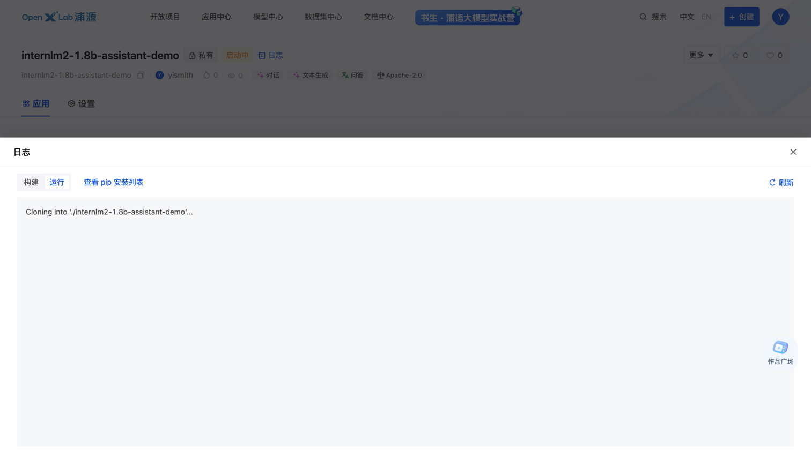
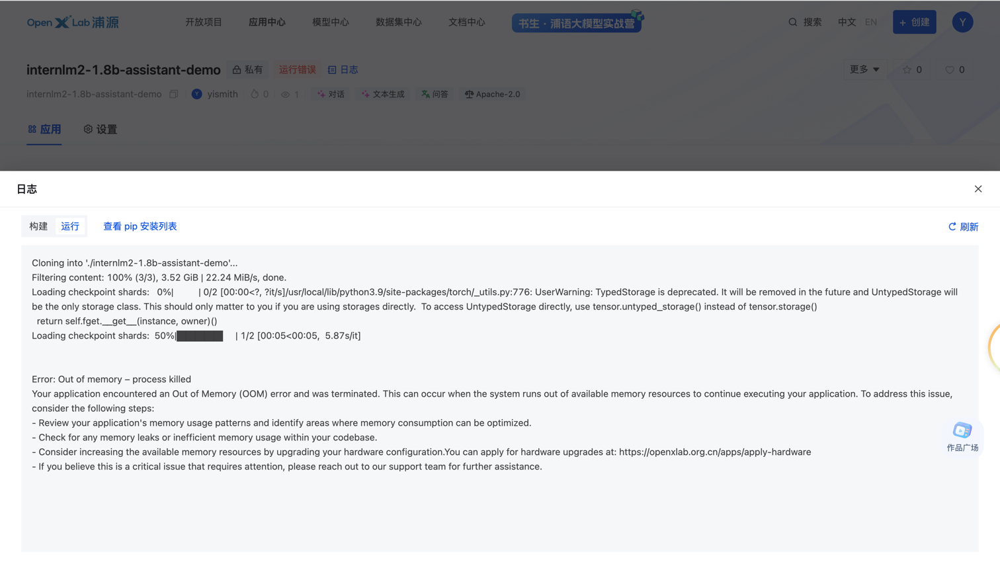


当前无gpu资源，待gpu资源申请后继续验证运行情况。

### 2.2
> 复现多模态微调（优秀学员必做）

参考 笔记中的 [实战-多模态微调](note.md#实战-多模态微调)

