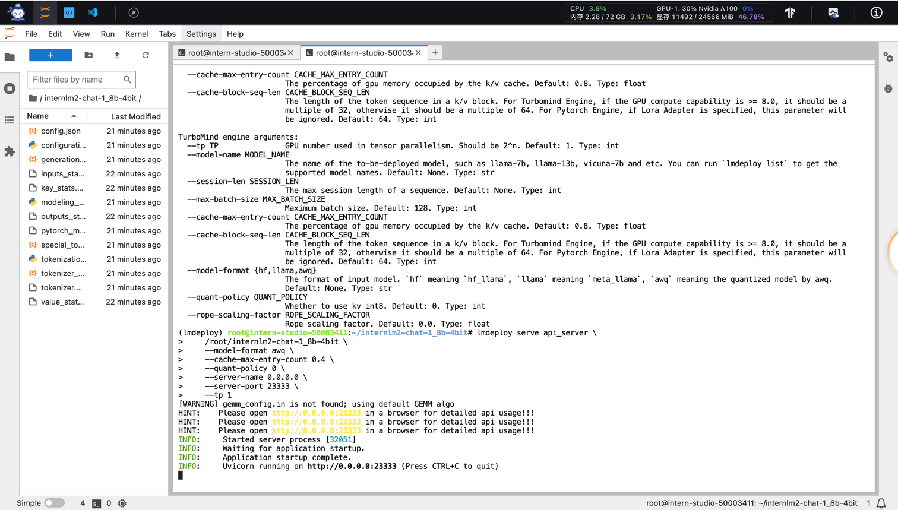
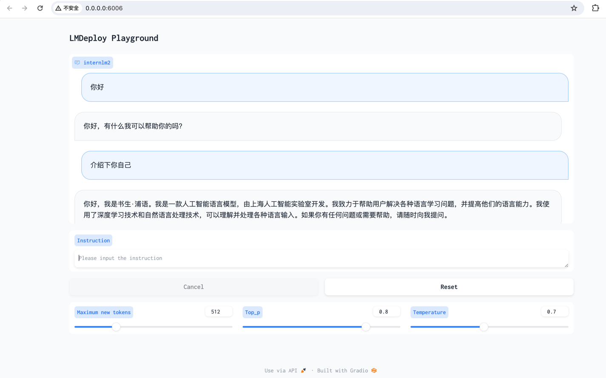
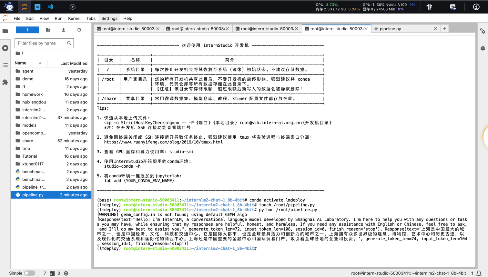

# LMDeploy 量化部署 LLM 实践

## 1. 基础作业 (结营必做)
### 1.1
> 完成以下任务，并将实现过程记录截图：
> - 配置 LMDeploy 运行环境
> - 以命令行方式与 InternLM2-Chat-1.8B 模型对话

参考 笔记中的 [动手实践](note.md#动手实践)


## 2. 进阶作业
完成以下任务，并将实现过程记录截图

### 2.1
> - 设置KV Cache最大占用比例为0.4，开启W4A16量化，以命令行方式与模型对话。（优秀学员必做）

切换到lmdeploy环境
```shell
conda env list
conda activate lmdeploy
```

以默认方式运行模型
```shell
lmdeploy chat /root/internlm2-chat-1_8b
```


以KV Cache=0.4方式运行模型
```shell
lmdeploy chat /root/internlm2-chat-1_8b --cache-max-entry-count 0.4
```


以KV Cache=0.01方式运行模型
```shell
lmdeploy chat /root/internlm2-chat-1_8b --cache-max-entry-count 0.01
```


安装依赖
```shell
pip install einops==0.7.0
```
量化模型
```shell
lmdeploy lite auto_awq \
   /root/internlm2-chat-1_8b \
  --calib-dataset 'ptb' \
  --calib-samples 128 \
  --calib-seqlen 1024 \
  --w-bits 4 \
  --w-group-size 128 \
  --work-dir /root/internlm2-chat-1_8b-4bit
```


以W4A16方式运行模型
```shell
lmdeploy chat /root/internlm2-chat-1_8b-4bit
```


以W4A16、KV Cache=0.01方式运行模型
```shell
lmdeploy chat /root/internlm2-chat-1_8b-4bit --cache-max-entry-count 0.01
```


以W4A16、KV Cache=0.4方式运行模型
```shell
lmdeploy chat /root/internlm2-chat-1_8b-4bit --cache-max-entry-count 0.4
```


以W4A16、KV Cache=0.4方式与模型对话


对于该任务历史操作回顾
```shell
    1  conda env list
    2  conda activate lmdeploy
    3  lmdeploy chat /root/internlm2-chat-1_8b
    4  lmdeploy chat /root/internlm2-chat-1_8b --cache-max-entry-count 0.4
    5  lmdeploy chat /root/internlm2-chat-1_8b --cache-max-entry-count 0.01
    6  pip install einops==0.7.0
    7  lmdeploy lite auto_awq    /root/internlm2-chat-1_8b   --calib-dataset 'ptb'   --calib-samples 128   --calib-seqlen 1024   --w-bits 4   --w-group-size 128   --work-dir /root/internlm2-chat-1_8b-4bit
    8  lmdeploy chat /root/internlm2-chat-1_8b-4bit
    9  lmdeploy chat /root/internlm2-chat-1_8b-4bit --cache-max-entry-count 0.4
   10  lmdeploy chat /root/internlm2-chat-1_8b-4bit --cache-max-entry-count 0.01
   11  history
   12  lmdeploy chat /root/internlm2-chat-1_8b-4bit --cache-max-entry-count 0.4
   13  history
```


### 2.2
> - 以API Server方式启动 lmdeploy，开启 W4A16量化，调整KV Cache的占用比例为0.4，分别使用命令行客户端与Gradio网页客户端与模型对话。（优秀学员必做）

切换到lmdeploy环境
```shell
conda activate lmdeploy
```

查看`lmdeploy serve api_server`使用方式
```shell
lmdeploy serve api_server -h
```

以W4A16、KV Cache=0.4方式运行模型
```shell
lmdeploy serve api_server \
    /root/internlm2-chat-1_8b-4bit \
    --model-format awq \
    --cache-max-entry-count 0.4 \
    --quant-policy 0 \
    --server-name 0.0.0.0 \
    --server-port 23333 \
    --tp 1
```




切换到lmdeploy环境
```shell
conda activate lmdeploy
```

以命令行方式与模型对话
```shell
lmdeploy serve api_client http://localhost:23333
```


启动gradio
```shell
lmdeploy serve gradio http://localhost:23333 \
    --server-name 0.0.0.0 \
    --server-port 6006
```


端口映射
```shell
ssh -CNg -L 6006:127.0.0.1:6006 root@ssh.intern-ai.org.cn -p <你的ssh端口号>
```

以gradio方式与模型对话


对于该任务历史操作回顾-api_server
```shell
    1  conda activate lmdeploy
    2  lmdeploy serve api_server -h
    3  lmdeploy serve api_server     /root/internlm2-chat-1_8b-4bit     --model-format awq     --cache-max-entry-count 0.4     --quant-policy 0     --server-name 0.0.0.0     --server-port 23333     --tp 1
    4  history
```


对于该任务历史操作回顾-客户端
```shell
    1  conda activate lmdeploy
    2  lmdeploy serve api_client http://localhost:23333
    3  lmdeploy serve gradio http://localhost:23333     --server-name 0.0.0.0     --server-port 6006
    4  history
```


### 2.3
> - 使用W4A16量化，调整KV Cache的占用比例为0.4，使用Python代码集成的方式运行internlm2-chat-1.8b模型。（优秀学员必做）

切换到lmdeploy环境
```shell
conda activate lmdeploy
```

创建python脚本
```shell
touch /root/pipeline.py
```
```python
from lmdeploy import pipeline

pipe = pipeline('/root/internlm2-chat-1_8b')
response = pipe(['Hi, pls intro yourself', '上海是'])
print(response)
```

运行python脚本
```shell
python /root/pipeline.py
```




创建python脚本(KV Cache=0.2)
```shell
touch /root/pipeline_kv.py
```
```python
from lmdeploy import pipeline, TurbomindEngineConfig

# 调低 k/v cache内存占比调整为总显存的 20%
backend_config = TurbomindEngineConfig(cache_max_entry_count=0.2)

pipe = pipeline('/root/internlm2-chat-1_8b',
                backend_config=backend_config)
response = pipe(['Hi, pls intro yourself', '上海是'])
print(response)
```

运行python脚本(KV Cache=0.2)
```shell
python /root/pipeline_kv.py
```


创建python脚本(W4A16,KV Cache=0.4)
```shell
touch /root/pipeline_w4a16_kv0_4.py
```
```python
from lmdeploy import pipeline, TurbomindEngineConfig

# 调低 k/v cache内存占比调整为总显存的 40%
backend_config = TurbomindEngineConfig(cache_max_entry_count=0.4)

pipe = pipeline('/root/internlm2-chat-1_8b-4bit',
                backend_config=backend_config)
response = pipe(['Hi, pls intro yourself', '上海是'])
print(response)
```

运行python脚本(W4A16,KV Cache=0.4)
```shell
python /root/pipeline_w4a16_kv0_4.py
```


对于该任务历史操作回顾
```shell
    1  conda activate lmdeploy
    2  touch /root/pipeline.py
    3  python /root/pipeline.py
    4  touch /root/pipeline_kv.py
    5  python /root/pipeline_kv.py
    6  touch /root/pipeline_w4a16_kv0_4.py
    7  python /root/pipeline_w4a16_kv0_4.py
    8  history
```


### 2.4
> - 使用 LMDeploy 运行视觉多模态大模型 llava gradio demo。（优秀学员必做）

切换到lmdeploy环境
```shell
conda activate lmdeploy
```

下载LLaVA
```shell
pip install git+https://github.com/haotian-liu/LLaVA.git@4e2277a060da264c4f21b364c867cc622c945874
```

创建python脚本
```shell
touch /root/pipeline_llava.py
```
```python
from lmdeploy.vl import load_image
from lmdeploy import pipeline, TurbomindEngineConfig


backend_config = TurbomindEngineConfig(session_len=8192) # 图片分辨率较高时请调高session_len
# pipe = pipeline('liuhaotian/llava-v1.6-vicuna-7b', backend_config=backend_config) 非开发机运行此命令
pipe = pipeline('/share/new_models/liuhaotian/llava-v1.6-vicuna-7b', backend_config=backend_config)

image = load_image('https://raw.githubusercontent.com/open-mmlab/mmdeploy/main/tests/data/tiger.jpeg')
response = pipe(('describe this image', image))
print(response)
```

以命令行方式运行llava与对话
```shell
python /root/pipeline_llava.py
```


创建gradio_llava python脚本
```shell
touch /root/gradio_llava.py
```
```python
import gradio as gr
from lmdeploy import pipeline, TurbomindEngineConfig


backend_config = TurbomindEngineConfig(session_len=8192) # 图片分辨率较高时请调高session_len
# pipe = pipeline('liuhaotian/llava-v1.6-vicuna-7b', backend_config=backend_config) 非开发机运行此命令
pipe = pipeline('/share/new_models/liuhaotian/llava-v1.6-vicuna-7b', backend_config=backend_config)

def model(image, text):
    if image is None:
        return [(text, "请上传一张图片。")]
    else:
        response = pipe((text, image)).text
        return [(text, response)]

demo = gr.Interface(fn=model, inputs=[gr.Image(type="pil"), gr.Textbox()], outputs=gr.Chatbot())
demo.launch()   
```

运行gradio
```shell
python /root/gradio_llava.py
```


端口映射
```shell
ssh -CNg -L 7860:127.0.0.1:7860 root@ssh.intern-ai.org.cn -p <你的ssh端口>
```

以gradio方式与llava对话


对于该任务历史操作回顾
```shell
    1  conda activate lmdeploy
    2  pip install git+https://github.com/haotian-liu/LLaVA.git@4e2277a060da264c4f21b364c867cc622c945874
    3  touch /root/pipeline_llava.py
    4  python /root/pipeline_llava.py
    5  touch /root/gradio_llava.py
    6  python /root/gradio_llava.py
    7  history
```


### 2.5
> - 将 LMDeploy Web Demo 部署到 [OpenXLab](https://github.com/InternLM/Tutorial/blob/camp2/tools/openxlab-deploy) 。
