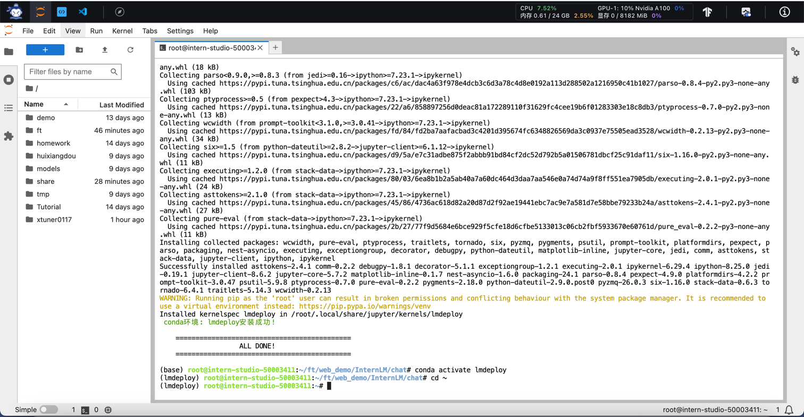
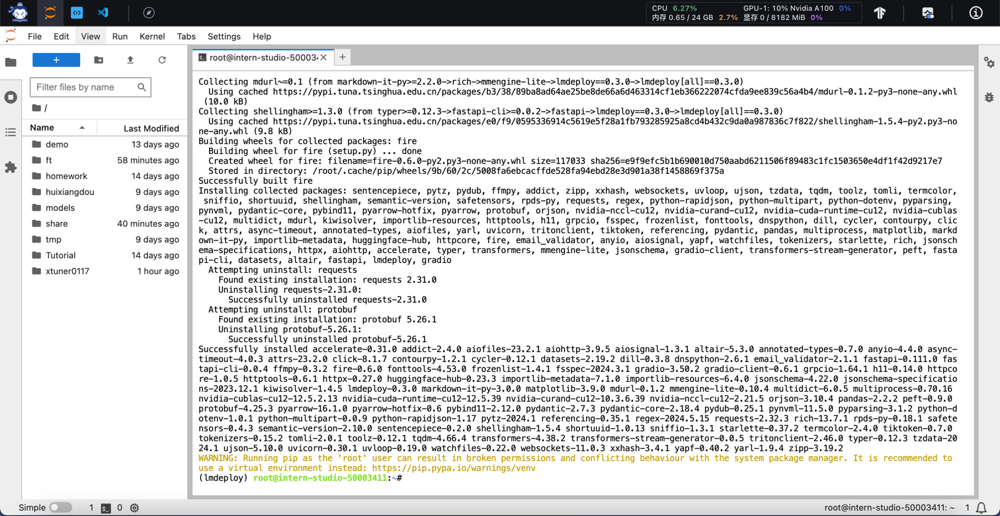
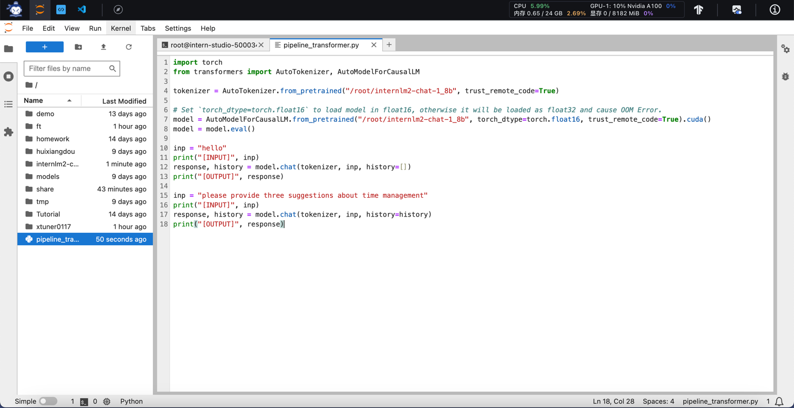
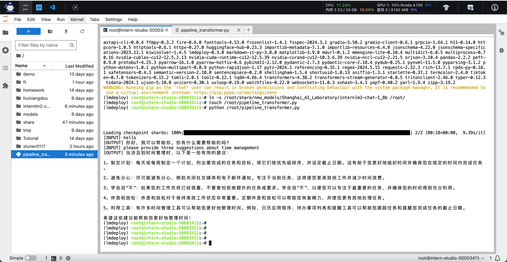
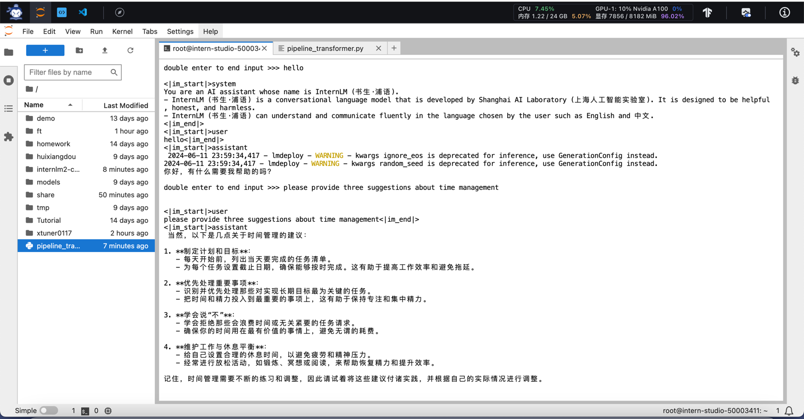
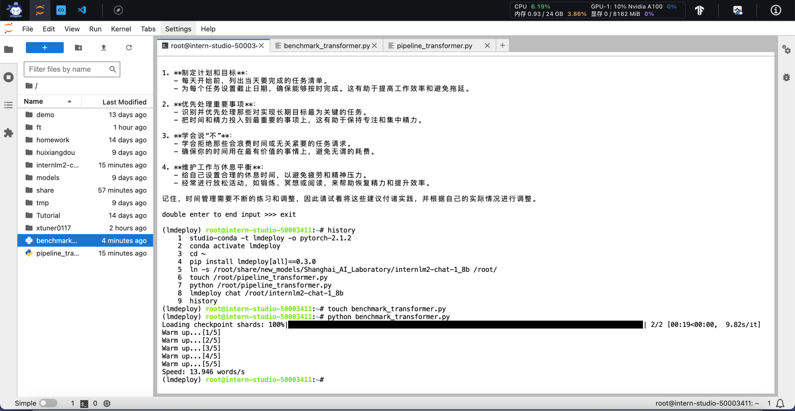
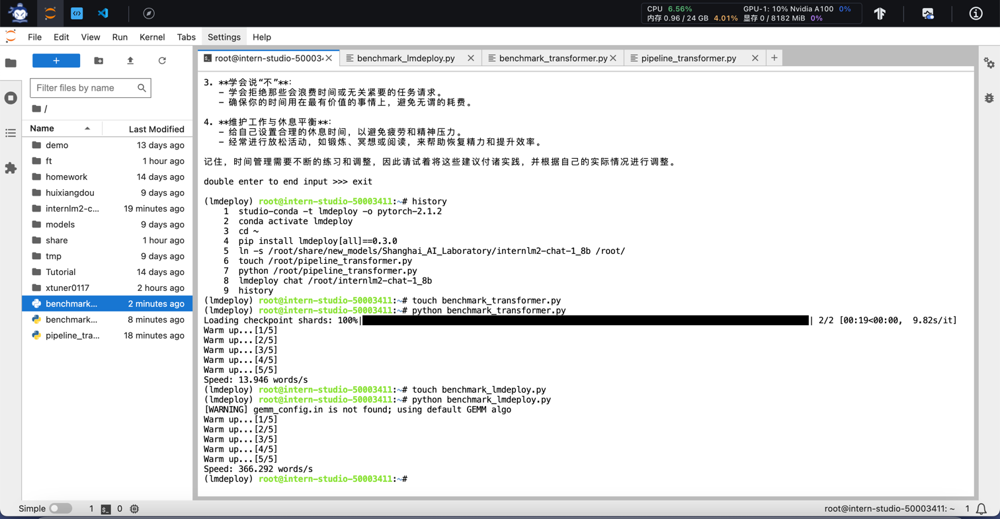
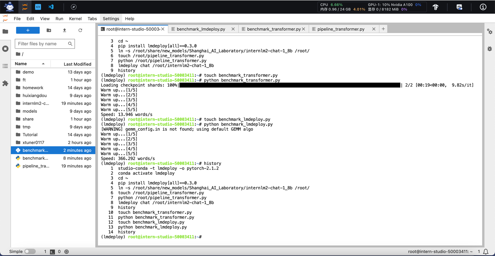

# LMDeploy 量化部署 LLM 实践

## 视频笔记
### 过程记录
- 大模型部署背景
  - 部署的定义
  - 场景
  - 部署面临的挑战
    - 计算量巨大
    - 内存开销巨大
    - 访存瓶颈
    - 动态请求
- 大模型部署方法
  - 模型剪枝（Pruning）
  - 知识蒸馏（Knowledge Distillation）
  - 量化（Quantization）
- LMDeploy简介
  - 核心能力
    - 模型高效推理 lmdeploy chat -h
    - 模型量化压缩 lmdeploy lite -h
    - 服务化部署 lmdeploy serve -h
  - 性能
  - 支持视觉多模态
  - 支持更多模型
- 动手实践环节
  - 安装
  - 部署
  - 量化


### 内容整理
通过本节课程的学习可以了解到模型部署会面临的挑战，模型的部署方法都有哪些，LMDeploy的使用方式以及实际操作的流程是怎样的。

#### 动手实践
下面跟随视频实际使用LMDeploy

创建环境，大约需要25分钟
```shell
studio-conda -t lmdeploy -o pytorch-2.1.2

conda activate lmdeploy
```




安装lmdeploy
```shell
pip install lmdeploy[all]==0.3.0
```




模型准备
```shell
ln -s /root/share/new_models/Shanghai_AI_Laboratory/internlm2-chat-1_8b /root/
# cp -r /root/share/new_models/Shanghai_AI_Laboratory/internlm2-chat-1_8b /root/
```

创建transformer推理脚本
```shell
touch /root/pipeline_transformer.py
```

```python
import torch
from transformers import AutoTokenizer, AutoModelForCausalLM

tokenizer = AutoTokenizer.from_pretrained("/root/internlm2-chat-1_8b", trust_remote_code=True)

# Set `torch_dtype=torch.float16` to load model in float16, otherwise it will be loaded as float32 and cause OOM Error.
model = AutoModelForCausalLM.from_pretrained("/root/internlm2-chat-1_8b", torch_dtype=torch.float16, trust_remote_code=True).cuda()
model = model.eval()

inp = "hello"
print("[INPUT]", inp)
response, history = model.chat(tokenizer, inp, history=[])
print("[OUTPUT]", response)

inp = "please provide three suggestions about time management"
print("[INPUT]", inp)
response, history = model.chat(tokenizer, inp, history=history)
print("[OUTPUT]", response)

```




运行transformer推理
```shell
python /root/pipeline_transformer.py
```




运行lmdeploy推理
```shell
lmdeploy chat /root/internlm2-chat-1_8b
```




创建transformer的benchmark脚本
```shell
touch benchmark_transformer.py
```
```shell
import torch
import datetime
from transformers import AutoTokenizer, AutoModelForCausalLM

tokenizer = AutoTokenizer.from_pretrained("/root/internlm2-chat-1_8b", trust_remote_code=True)

# Set `torch_dtype=torch.float16` to load model in float16, otherwise it will be loaded as float32 and cause OOM Error.
model = AutoModelForCausalLM.from_pretrained("/root/internlm2-chat-1_8b", torch_dtype=torch.float16, trust_remote_code=True).cuda()
model = model.eval()

# warmup
inp = "hello"
for i in range(5):
    print("Warm up...[{}/5]".format(i+1))
    response, history = model.chat(tokenizer, inp, history=[])

# test speed
inp = "请介绍一下你自己。"
times = 10
total_words = 0
start_time = datetime.datetime.now()
for i in range(times):
    response, history = model.chat(tokenizer, inp, history=history)
    total_words += len(response)
end_time = datetime.datetime.now()

delta_time = end_time - start_time
delta_time = delta_time.seconds + delta_time.microseconds / 1000000.0
speed = total_words / delta_time
print("Speed: {:.3f} words/s".format(speed))

```

运行transformer的benchmark脚本
```shell
python benchmark_transformer.py
```



创建lmdeploy的benchmark脚本
```shell
touch benchmark_lmdeploy.py
```
```python
import datetime
from lmdeploy import pipeline

pipe = pipeline('/root/internlm2-chat-1_8b')

# warmup
inp = "hello"
for i in range(5):
    print("Warm up...[{}/5]".format(i+1))
    response = pipe([inp])

# test speed
inp = "请介绍一下你自己。"
times = 10
total_words = 0
start_time = datetime.datetime.now()
for i in range(times):
    response = pipe([inp])
    total_words += len(response[0].text)
end_time = datetime.datetime.now()

delta_time = end_time - start_time
delta_time = delta_time.seconds + delta_time.microseconds / 1000000.0
speed = total_words / delta_time
print("Speed: {:.3f} words/s".format(speed))

```

运行lmdeploy的benchmark脚本
```shell
python benchmark_lmdeploy.py
```




对于该实战任务历史操作回顾
```shell
    1  studio-conda -t lmdeploy -o pytorch-2.1.2
    2  conda activate lmdeploy
    3  cd ~
    4  pip install lmdeploy[all]==0.3.0
    5  ln -s /root/share/new_models/Shanghai_AI_Laboratory/internlm2-chat-1_8b /root/
    6  touch /root/pipeline_transformer.py
    7  python /root/pipeline_transformer.py
    8  lmdeploy chat /root/internlm2-chat-1_8b
    9  history
   10  touch benchmark_transformer.py
   11  python benchmark_transformer.py
   12  touch benchmark_lmdeploy.py
   13  python benchmark_lmdeploy.py
   14  history
```




#### 总结
通过这节课程的学习，对于模型的部署与量化有了进一步的了解，后续在实际使用模型的过程中再逐步加深对理论知识的理解。


