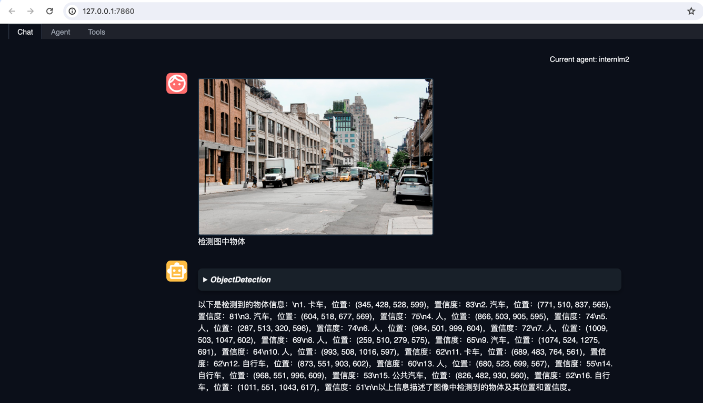

# Lagent & AgentLego 智能体应用搭建

## 视频笔记
### 过程记录
- 为什么要有智能体
  - 局限性
    - 幻觉
    - 时效性
    - 可靠性
- 什么是智能体
  - 大脑
  - 感知
  - 动作
- 智能体范式
  - AutoGPT
  - ReWoo
  - ReAct
- Lagent
- AgentLego
- 实战

### 内容整理
通过本节课程的学习可以了解到智能体出现的原因，智能体的定义是怎样的，它都有哪些范式，以及Lagent与AgentLego的使用方式等。

智能体出现的原因


智能体的定义


智能体的范式


Lagent与AgentLego的关系


#### 实战-环境配置
下面跟随视频实际使用Lagent与AgentLego

创建环境，大约需要20分钟
```shell
mkdir -p /root/agent
studio-conda -t agent -o pytorch-2.1.2
```


下载和安装lagent与agentlego
```shell
conda activate agent
cd /root/agent
git clone https://gitee.com/internlm/lagent.git
cd lagent && git checkout 581d9fb && pip install -e . && cd ..
git clone https://gitee.com/internlm/agentlego.git
cd agentlego && git checkout 7769e0d && pip install -e . && cd ..
```

安装lmdeploy
```shell
pip install lmdeploy==0.3.0
```

下载Tutorial
```shell
git clone -b camp2 https://gitee.com/internlm/Tutorial.git
```


#### 实战-Lagent
##### 实战-Lagent-web-demo

通过lmdeploy运行internlm2-chat-7b
```shell
conda activate agent
lmdeploy serve api_server /root/share/new_models/Shanghai_AI_Laboratory/internlm2-chat-7b \
                            --server-name 127.0.0.1 \
                            --model-name internlm2-chat-7b \
                            --cache-max-entry-count 0.1
```


运行streamlit
```shell
conda activate agent
cd /root/agent/lagent/examples
streamlit run internlm2_agent_web_demo.py --server.address 127.0.0.1 --server.port 7860

```


端口映射
```shell
ssh -CNg -L 7860:127.0.0.1:7860 -L 23333:127.0.0.1:23333 root@ssh.intern-ai.org.cn -p 你的 ssh 端口号
```

与模型对话


##### 实战-Lagent-自定义工具
创建天气工具
```shell
touch /root/agent/lagent/lagent/actions/weather.py
```
```python
import json
import os
import requests
from typing import Optional, Type

from lagent.actions.base_action import BaseAction, tool_api
from lagent.actions.parser import BaseParser, JsonParser
from lagent.schema import ActionReturn, ActionStatusCode

class WeatherQuery(BaseAction):
    """Weather plugin for querying weather information."""
    
    def __init__(self,
                 key: Optional[str] = None,
                 description: Optional[dict] = None,
                 parser: Type[BaseParser] = JsonParser,
                 enable: bool = True) -> None:
        super().__init__(description, parser, enable)
        key = os.environ.get('WEATHER_API_KEY', key)
        if key is None:
            raise ValueError(
                'Please set Weather API key either in the environment '
                'as WEATHER_API_KEY or pass it as `key`')
        self.key = key
        self.location_query_url = 'https://geoapi.qweather.com/v2/city/lookup'
        self.weather_query_url = 'https://devapi.qweather.com/v7/weather/now'

    @tool_api
    def run(self, query: str) -> ActionReturn:
        """一个天气查询API。可以根据城市名查询天气信息。
        
        Args:
            query (:class:`str`): The city name to query.
        """
        tool_return = ActionReturn(type=self.name)
        status_code, response = self._search(query)
        if status_code == -1:
            tool_return.errmsg = response
            tool_return.state = ActionStatusCode.HTTP_ERROR
        elif status_code == 200:
            parsed_res = self._parse_results(response)
            tool_return.result = [dict(type='text', content=str(parsed_res))]
            tool_return.state = ActionStatusCode.SUCCESS
        else:
            tool_return.errmsg = str(status_code)
            tool_return.state = ActionStatusCode.API_ERROR
        return tool_return
    
    def _parse_results(self, results: dict) -> str:
        """Parse the weather results from QWeather API.
        
        Args:
            results (dict): The weather content from QWeather API
                in json format.
        
        Returns:
            str: The parsed weather results.
        """
        now = results['now']
        data = [
            f'数据观测时间: {now["obsTime"]}',
            f'温度: {now["temp"]}°C',
            f'体感温度: {now["feelsLike"]}°C',
            f'天气: {now["text"]}',
            f'风向: {now["windDir"]}，角度为 {now["wind360"]}°',
            f'风力等级: {now["windScale"]}，风速为 {now["windSpeed"]} km/h',
            f'相对湿度: {now["humidity"]}',
            f'当前小时累计降水量: {now["precip"]} mm',
            f'大气压强: {now["pressure"]} 百帕',
            f'能见度: {now["vis"]} km',
        ]
        return '\n'.join(data)

    def _search(self, query: str):
        # get city_code
        try:
            city_code_response = requests.get(
                self.location_query_url,
                params={'key': self.key, 'location': query}
            )
        except Exception as e:
            return -1, str(e)
        if city_code_response.status_code != 200:
            return city_code_response.status_code, city_code_response.json()
        city_code_response = city_code_response.json()
        if len(city_code_response['location']) == 0:
            return -1, '未查询到城市'
        city_code = city_code_response['location'][0]['id']
        # get weather
        try:
            weather_response = requests.get(
                self.weather_query_url,
                params={'key': self.key, 'location': city_code}
            )
        except Exception as e:
            return -1, str(e)
        return weather_response.status_code, weather_response.json()
```

运行streamlit（自定义工具-天气）
```shell
cd /root/agent/Tutorial/agent
streamlit run internlm2_weather_web_demo.py --server.address 127.0.0.1 --server.port 7860
```


与模型对话（自定义工具-天气）


##### 实战-Lagent-操作回顾

对于该实战任务历史操作回顾
```shell
    1  mkdir -p /root/agent
    2  studio-conda -t agent -o pytorch-2.1.2
    3  conda activate agent
    4  cd /root/agent
    5  git clone https://gitee.com/internlm/lagent.git
    6  cd lagent && git checkout 581d9fb && pip install -e . && cd ..
    7  git clone https://gitee.com/internlm/agentlego.git
    8  cd agentlego && git checkout 7769e0d && pip install -e . && cd ..
    9  pip install lmdeploy==0.3.0
   10  git clone -b camp2 https://gitee.com/internlm/Tutorial.git
   11  conda activate agent
   12  cd /root/agent/lagent/examples
   13  streamlit run internlm2_agent_web_demo.py --server.address 127.0.0.1 --server.port 7860
   14  touch /root/agent/lagent/lagent/actions/weather.py
   15  cd /root/agent/Tutorial/agent
   16  streamlit run internlm2_weather_web_demo.py --server.address 127.0.0.1 --server.port 7860
   17  history
```


#### 实战-AgentLego
##### 实战-AgentLego-直接使用

安装依赖
```shell
pip install openmim==0.3.9
mim install mmdet==3.3.0
```

创建AgentLego直接使用例子的脚本
```shell
touch /root/agent/direct_use.py
```
```python
import re

import cv2
from agentlego.apis import load_tool

# load tool
tool = load_tool('ObjectDetection', device='cuda')

# apply tool
visualization = tool('/root/agent/road.jpg')
print(visualization)

# visualize
image = cv2.imread('/root/agent/road.jpg')

preds = visualization.split('\n')
pattern = r'(\w+) \((\d+), (\d+), (\d+), (\d+)\), score (\d+)'

for pred in preds:
    name, x1, y1, x2, y2, score = re.match(pattern, pred).groups()
    x1, y1, x2, y2, score = int(x1), int(y1), int(x2), int(y2), int(score)
    cv2.rectangle(image, (x1, y1), (x2, y2), (0, 255, 0), 1)
    cv2.putText(image, f'{name} {score}', (x1, y1), cv2.FONT_HERSHEY_SIMPLEX, 0.8, (0, 255, 0), 1)

cv2.imwrite('/root/agent/road_detection_direct.jpg', image)
```

运行AgentLego直接使用例子的脚本
```shell
python /root/agent/direct_use.py
```


##### 实战-AgentLego-作为智能体工具使用
```shell
vim /root/agent/agentlego/webui/modules/agents/lagent_agent.py
```
第105行位置，将 internlm2-chat-20b 修改为 internlm2-chat-7b


运行AgentLego-webui
```shell
cd /root/agent/agentlego/webui
python one_click.py
```


添加agent


添加工具


与模型对话



##### 实战-AgentLego-自定义工具

创建图片生成脚本
```shell
touch /root/agent/agentlego/agentlego/tools/magicmaker_image_generation.py
```
```python
import json
import requests

import numpy as np

from agentlego.types import Annotated, ImageIO, Info
from agentlego.utils import require
from .base import BaseTool


class MagicMakerImageGeneration(BaseTool):

    default_desc = ('This tool can call the api of magicmaker to '
                    'generate an image according to the given keywords.')

    styles_option = [
        'dongman',  # 动漫
        'guofeng',  # 国风
        'xieshi',   # 写实
        'youhua',   # 油画
        'manghe',   # 盲盒
    ]
    aspect_ratio_options = [
        '16:9', '4:3', '3:2', '1:1',
        '2:3', '3:4', '9:16'
    ]

    @require('opencv-python')
    def __init__(self,
                 style='guofeng',
                 aspect_ratio='4:3'):
        super().__init__()
        if style in self.styles_option:
            self.style = style
        else:
            raise ValueError(f'The style must be one of {self.styles_option}')
        
        if aspect_ratio in self.aspect_ratio_options:
            self.aspect_ratio = aspect_ratio
        else:
            raise ValueError(f'The aspect ratio must be one of {aspect_ratio}')

    def apply(self,
              keywords: Annotated[str,
                                  Info('A series of Chinese keywords separated by comma.')]
        ) -> ImageIO:
        import cv2
        response = requests.post(
            url='https://magicmaker.openxlab.org.cn/gw/edit-anything/api/v1/bff/sd/generate',
            data=json.dumps({
                "official": True,
                "prompt": keywords,
                "style": self.style,
                "poseT": False,
                "aspectRatio": self.aspect_ratio
            }),
            headers={'content-type': 'application/json'}
        )
        image_url = response.json()['data']['imgUrl']
        image_response = requests.get(image_url)
        image = cv2.cvtColor(cv2.imdecode(np.frombuffer(image_response.content, np.uint8), cv2.IMREAD_COLOR),cv2.COLOR_BGR2RGB)
        return ImageIO(image)
```

修改工具的__init__.py
```shell
vim /root/agent/agentlego/agentlego/tools/__init__.py
```

添加MagicMakerImageGeneration
- from .magicmaker_image_generation import MagicMakerImageGeneration
- 'MagicMakerImageGeneration'


运行AgentLego-webui
```shell
cd /root/agent/agentlego/webui
python one_click.py
```

添加工具（MagicMakerImageGeneration）


与模型对话


##### 实战-AgentLego-操作回顾
对于该实战任务历史操作回顾
```shell
    1  mkdir -p /root/agent
    2  studio-conda -t agent -o pytorch-2.1.2
    3  conda activate agent
    4  cd /root/agent
    5  git clone https://gitee.com/internlm/lagent.git
    6  cd lagent && git checkout 581d9fb && pip install -e . && cd ..
    7  git clone https://gitee.com/internlm/agentlego.git
    8  cd agentlego && git checkout 7769e0d && pip install -e . && cd ..
    9  pip install lmdeploy==0.3.0
   10  git clone -b camp2 https://gitee.com/internlm/Tutorial.git
   11  conda activate agent
   12  cd /root/agent/lagent/examples
   13  streamlit run internlm2_agent_web_demo.py --server.address 127.0.0.1 --server.port 7860
   14  touch /root/agent/lagent/lagent/actions/weather.py
   15  cd /root/agent/Tutorial/agent
   16  streamlit run internlm2_weather_web_demo.py --server.address 127.0.0.1 --server.port 7860
   17  history
   18  cd /root/agent
   19  wget http://download.openmmlab.com/agentlego/road.jpg
   20  pip install openmim==0.3.9
   21  mim install mmdet==3.3.0
   22  touch /root/agent/direct_use.py
   23  python /root/agent/direct_use.py
   24  cd /root/agent/agentlego/webui
   25  python one_click.py
   26  pip install -U langchain-community
   27  python one_click.py
   28  touch /root/agent/agentlego/agentlego/tools/magicmaker_image_generation.py
   29  cd /root/agent/agentlego/webui
   30  python one_click.py
   31  history
```


#### 总结
通过这节课程的学习，对于智能体有了更进一步的了解，后续需要根据Lagent的源码来进一步了解其中的原理来加深对智能体的认识。


