# OpenCompass 大模型评测实战

## 视频笔记
### 过程记录
- 介绍
  - 如何通过能力评测促进模型发展
    - 面向未来 拓展能力维度
    - 扎根通用能力 聚焦垂直行业
    - 高质量中文基准
    - 性能评测 反哺能力迭代
  - 挑战
    - 全面性
    - 评测成本
    - 数据污染
    - 鲁棒性 
  - 开源历程
  - 如何评测
    - 类型
      - 基座模型
      - 对话模型
      - 公开权重的开源模型
      - API模型
    - 客观与主观评测
      - 客观问答题
      - 客观选择题
      - 开放式主观问答 人类评价/模型评价
    - 提示词工程
    - 长文本评测
    - 工具+基准+榜单三位一体
    - CompassRank
    - CompassKit大模型评测全栈工具链
      - 数据污染检查
      - 模型推理服务
      - 长文本能力评测
      - 中英文双语主观评测
      - OpenCompass评测流水线
      - VLMEvalKit多模态评测工具
      - Code-Evaluator代码评测工具
      - MixtralKit MoE模型入门工具
    - CompassHub高质量评测基准社区
      - 基础能力
      - 综合能力
- 实战


### 内容整理
通过本节课程的学习可以了解到如何通过能力评测促进模型发展，当前面临的挑战以及评测的方式都有哪些，也可以了解到OpenCompass提供的CompassRank、CompassKit、CompassHub等评测相关的资源。

#### 实战操作
下面跟随视频实际进行评测操作

创建环境
```shell
studio-conda -o internlm-base -t opencompass
```

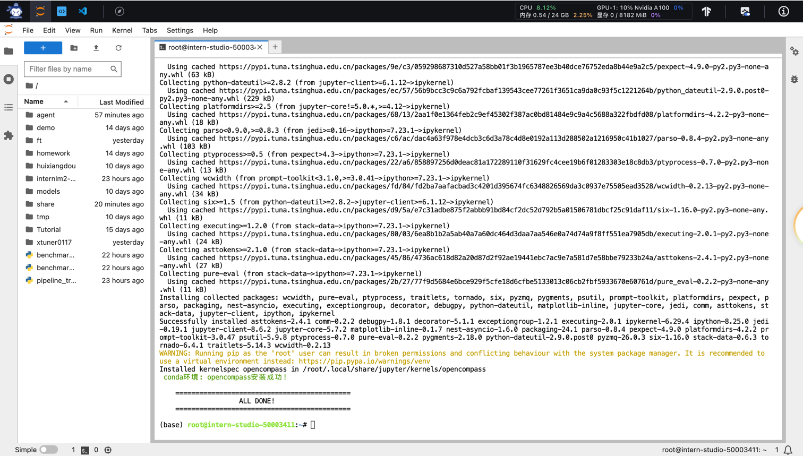


切换到opencompass环境
```shell
source activate opencompass
```

下载opencompass
```shell
git clone -b 0.2.4 https://github.com/open-compass/opencompass
cd opencompass
pip install -e .
```

拷贝与解压数据集
```shell
cp /share/temp/datasets/OpenCompassData-core-20231110.zip /root/opencompass/
unzip OpenCompassData-core-20231110.zip
```

查看与internlm和ceval相关的配置有哪些
```shell
python tools/list_configs.py internlm ceval
```

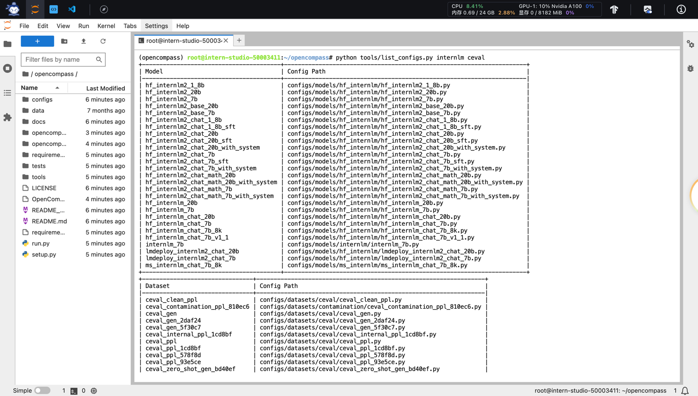


运行评测脚本
```shell
python run.py --datasets ceval_gen --hf-path /share/new_models/Shanghai_AI_Laboratory/internlm2-chat-1_8b --tokenizer-path /share/new_models/Shanghai_AI_Laboratory/internlm2-chat-1_8b --tokenizer-kwargs padding_side='left' truncation='left' trust_remote_code=True --model-kwargs trust_remote_code=True device_map='auto' --max-seq-len 1024 --max-out-len 16 --batch-size 2 --num-gpus 1 --debug
```

评测脚本参数说明
```shell
python run.py
--datasets ceval_gen \
--hf-path /share/new_models/Shanghai_AI_Laboratory/internlm2-chat-1_8b \  # HuggingFace 模型路径
--tokenizer-path /share/new_models/Shanghai_AI_Laboratory/internlm2-chat-1_8b \  # HuggingFace tokenizer 路径（如果与模型路径相同，可以省略）
--tokenizer-kwargs padding_side='left' truncation='left' trust_remote_code=True \  # 构建 tokenizer 的参数
--model-kwargs device_map='auto' trust_remote_code=True \  # 构建模型的参数
--max-seq-len 1024 \  # 模型可以接受的最大序列长度
--max-out-len 16 \  # 生成的最大 token 数
--batch-size 2  \  # 批量大小
--num-gpus 1  # 运行模型所需的 GPU 数量
--debug
```

执行脚本报错
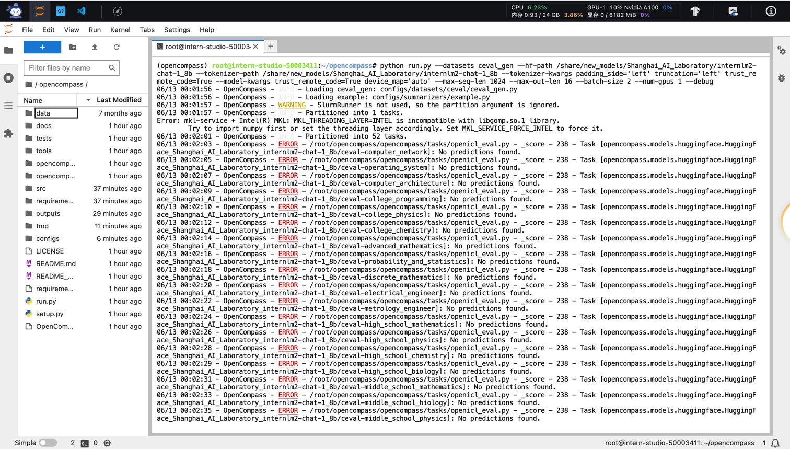
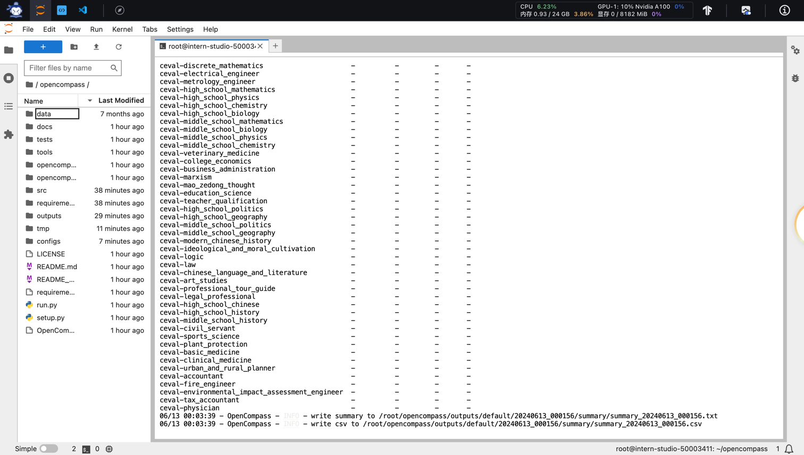

检查opencompass分支与切换
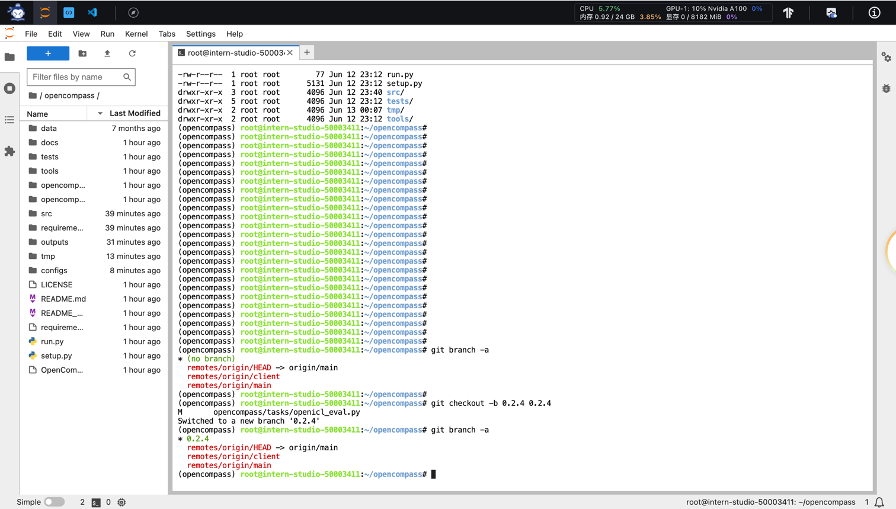

修复mkl-service + Intel(R) MKL MKL_THREADING_LAYER=INTEL is incompatible with libgomp.so.1 ...问题
```shell
export MKL_SERVICE_FORCE_INTEL=1
```

安装依赖
```shell
pip install protobuf
```

再次运行评测脚本
```shell
python run.py --datasets ceval_gen --hf-path /share/new_models/Shanghai_AI_Laboratory/internlm2-chat-1_8b --tokenizer-path /share/new_models/Shanghai_AI_Laboratory/internlm2-chat-1_8b --tokenizer-kwargs padding_side='left' truncation='left' trust_remote_code=True --model-kwargs trust_remote_code=True device_map='auto' --max-seq-len 1024 --max-out-len 16 --batch-size 2 --num-gpus 1 --debug
```
评测结果，耗时大约23分钟
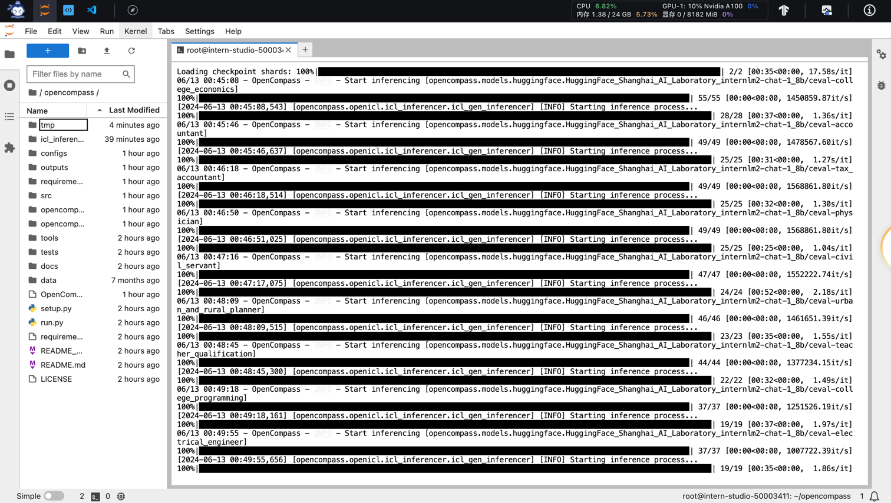
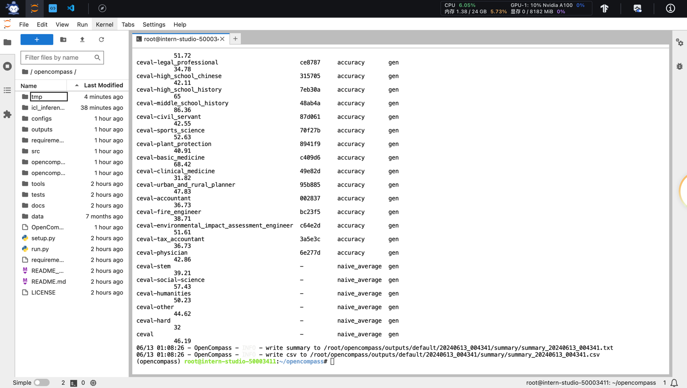

评测详情
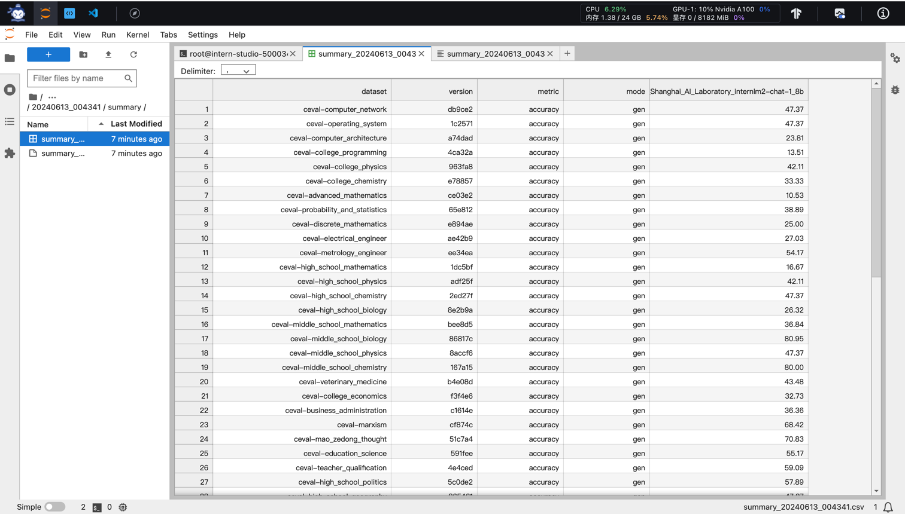
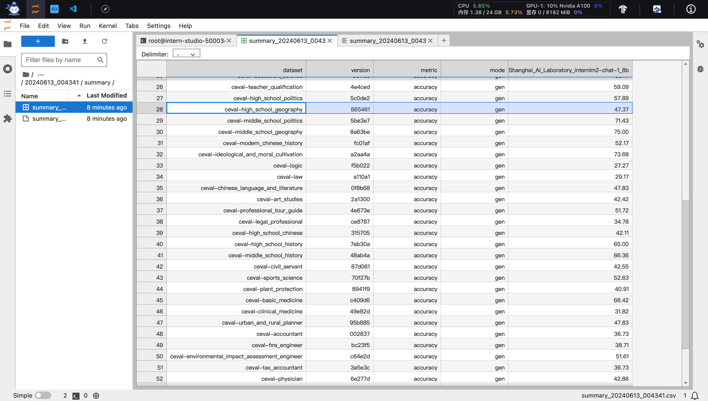
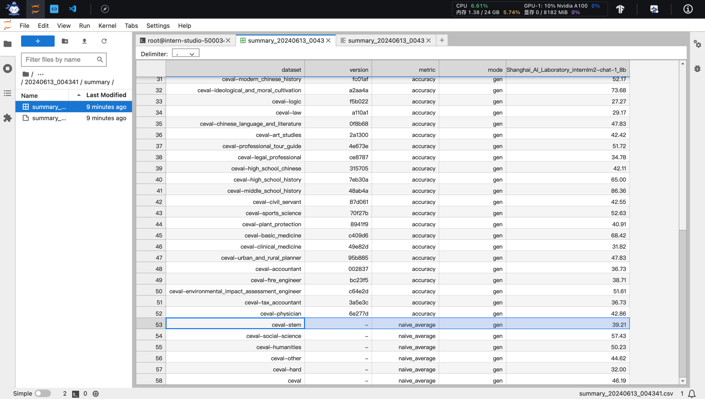

对于该实战任务历史操作回顾
```shell
    1  studio-conda -o internlm-base -t opencompass
    2  source activate opencompass
    3  git clone -b 0.2.4 https://github.com/open-compass/opencompass
    4  cd opencompass
    5  pip install -e .
    6  cp /share/temp/datasets/OpenCompassData-core-20231110.zip /root/opencompass/
    7  unzip OpenCompassData-core-20231110.zip
    8  python tools/list_configs.py internlm ceval
    9  pip install tabulate
   10  python tools/list_configs.py internlm ceval
   11  pip install tabulate
   12  pip install mmengine
   13  python tools/list_configs.py internlm ceval
   14  python run.py --datasets ceval_gen --hf-path /share/new_models/Shanghai_AI_Laboratory/internlm2-chat-1_8b --tokenizer-path /share/new_models/Shanghai_AI_Laboratory/internlm2-chat-1_8b --tokenizer-kwargs padding_side='left' truncation='left' trust_remote_code=True --model-kwargs trust_remote_code=True device_map='auto' --max-seq-len 1024 --max-out-len 16 --batch-size 2 --num-gpus 1 --debug
   15  pip install tqdm
   16  python run.py --datasets ceval_gen --hf-path /share/new_models/Shanghai_AI_Laboratory/internlm2-chat-1_8b --tokenizer-path /share/new_models/Shanghai_AI_Laboratory/internlm2-chat-1_8b --tokenizer-kwargs padding_side='left' truncation='left' trust_remote_code=True --model-kwargs trust_remote_code=True device_map='auto' --max-seq-len 1024 --max-out-len 16 --batch-size 2 --num-gpus 1 --debug
   17  pip install prettytable
   18  python run.py --datasets ceval_gen --hf-path /share/new_models/Shanghai_AI_Laboratory/internlm2-chat-1_8b --tokenizer-path /share/new_models/Shanghai_AI_Laboratory/internlm2-chat-1_8b --tokenizer-kwargs padding_side='left' truncation='left' trust_remote_code=True --model-kwargs trust_remote_code=True device_map='auto' --max-seq-len 1024 --max-out-len 16 --batch-size 2 --num-gpus 1 --debug
   19  pip install datasets
   20  python run.py --datasets ceval_gen --hf-path /share/new_models/Shanghai_AI_Laboratory/internlm2-chat-1_8b --tokenizer-path /share/new_models/Shanghai_AI_Laboratory/internlm2-chat-1_8b --tokenizer-kwargs padding_side='left' truncation='left' trust_remote_code=True --model-kwargs trust_remote_code=True device_map='auto' --max-seq-len 1024 --max-out-len 16 --batch-size 2 --num-gpus 1 --debug
   21  pip install transformers
   22  python run.py --datasets ceval_gen --hf-path /share/new_models/Shanghai_AI_Laboratory/internlm2-chat-1_8b --tokenizer-path /share/new_models/Shanghai_AI_Laboratory/internlm2-chat-1_8b --tokenizer-kwargs padding_side='left' truncation='left' trust_remote_code=True --model-kwargs trust_remote_code=True device_map='auto' --max-seq-len 1024 --max-out-len 16 --batch-size 2 --num-gpus 1 --debug
   23  pip install jieba
   24  python run.py --datasets ceval_gen --hf-path /share/new_models/Shanghai_AI_Laboratory/internlm2-chat-1_8b --tokenizer-path /share/new_models/Shanghai_AI_Laboratory/internlm2-chat-1_8b --tokenizer-kwargs padding_side='left' truncation='left' trust_remote_code=True --model-kwargs trust_remote_code=True device_map='auto' --max-seq-len 1024 --max-out-len 16 --batch-size 2 --num-gpus 1 --debug
   25  pip install sklearn
   26  pip install scikit-learn
   27  python run.py --datasets ceval_gen --hf-path /share/new_models/Shanghai_AI_Laboratory/internlm2-chat-1_8b --tokenizer-path /share/new_models/Shanghai_AI_Laboratory/internlm2-chat-1_8b --tokenizer-kwargs padding_side='left' truncation='left' trust_remote_code=True --model-kwargs trust_remote_code=True device_map='auto' --max-seq-len 1024 --max-out-len 16 --batch-size 2 --num-gpus 1 --debug
   28  pip install evaluate
   29  python run.py --datasets ceval_gen --hf-path /share/new_models/Shanghai_AI_Laboratory/internlm2-chat-1_8b --tokenizer-path /share/new_models/Shanghai_AI_Laboratory/internlm2-chat-1_8b --tokenizer-kwargs padding_side='left' truncation='left' trust_remote_code=True --model-kwargs trust_remote_code=True device_map='auto' --max-seq-len 1024 --max-out-len 16 --batch-size 2 --num-gpus 1 --debug
   30  pip install -r requirements.txt 
   31  python run.py --datasets ceval_gen --hf-path /share/new_models/Shanghai_AI_Laboratory/internlm2-chat-1_8b --tokenizer-path /share/new_models/Shanghai_AI_Laboratory/internlm2-chat-1_8b --tokenizer-kwargs padding_side='left' truncation='left' trust_remote_code=True --model-kwargs trust_remote_code=True device_map='auto' --max-seq-len 1024 --max-out-len 16 --batch-size 2 --num-gpus 1 --debug
   32  history
   33  python run.py --datasets ceval_gen --hf-path /share/new_models/Shanghai_AI_Laboratory/internlm2-chat-1_8b --tokenizer-path /share/new_models/Shanghai_AI_Laboratory/internlm2-chat-1_8b --tokenizer-kwargs padding_side='left' truncation='left' trust_remote_code=True --model-kwargs trust_remote_code=True device_map='auto' --max-seq-len 1024 --max-out-len 16 --batch-size 2 --num-gpus 1 --debug
   34  ls -hlt /share/new_models/Shanghai_AI_Laboratory/internlm2-chat-1_8b 
   35  ls -hlt /share/new_models/Shanghai_AI_Laboratory/internlm2-chat-1_8b
   36  ll
   37  git branch -a
   38  git branch
   39  ll
   40  git branch -a
   41  git checkout -b 0.2.4 0.2.4
   42  git branch -a
   43  python run.py --datasets ceval_gen --hf-path /share/new_models/Shanghai_AI_Laboratory/internlm2-chat-1_8b --tokenizer-path /share/new_models/Shanghai_AI_Laboratory/internlm2-chat-1_8b --tokenizer-kwargs padding_side='left' truncation='left' trust_remote_code=True --model-kwargs trust_remote_code=True device_map='auto' --max-seq-len 1024 --max-out-len 16 --batch-size 2 --num-gpus 1 --debug
   44  git reset --hard 0.2.4
   45  git branch -a
   46  python run.py --datasets ceval_gen --hf-path /share/new_models/Shanghai_AI_Laboratory/internlm2-chat-1_8b --tokenizer-path /share/new_models/Shanghai_AI_Laboratory/internlm2-chat-1_8b --tokenizer-kwargs padding_side='left' truncation='left' trust_remote_code=True --model-kwargs trust_remote_code=True device_map='auto' --max-seq-len 1024 --max-out-len 16 --batch-size 2 --num-gpus 1 --debug
   47  export MKL_SERVICE_FORCE_INTEL=1
   48  python run.py --datasets ceval_gen --hf-path /share/new_models/Shanghai_AI_Laboratory/internlm2-chat-1_8b --tokenizer-path /share/new_models/Shanghai_AI_Laboratory/internlm2-chat-1_8b --tokenizer-kwargs padding_side='left' truncation='left' trust_remote_code=True --model-kwargs trust_remote_code=True device_map='auto' --max-seq-len 1024 --max-out-len 16 --batch-size 2 --num-gpus 1 --debug
   49  pip install protobuf
   50  python run.py --datasets ceval_gen --hf-path /share/new_models/Shanghai_AI_Laboratory/internlm2-chat-1_8b --tokenizer-path /share/new_models/Shanghai_AI_Laboratory/internlm2-chat-1_8b --tokenizer-kwargs padding_side='left' truncation='left' trust_remote_code=True --model-kwargs trust_remote_code=True device_map='auto' --max-seq-len 1024 --max-out-len 16 --batch-size 2 --num-gpus 1 --debug
   51  history
```

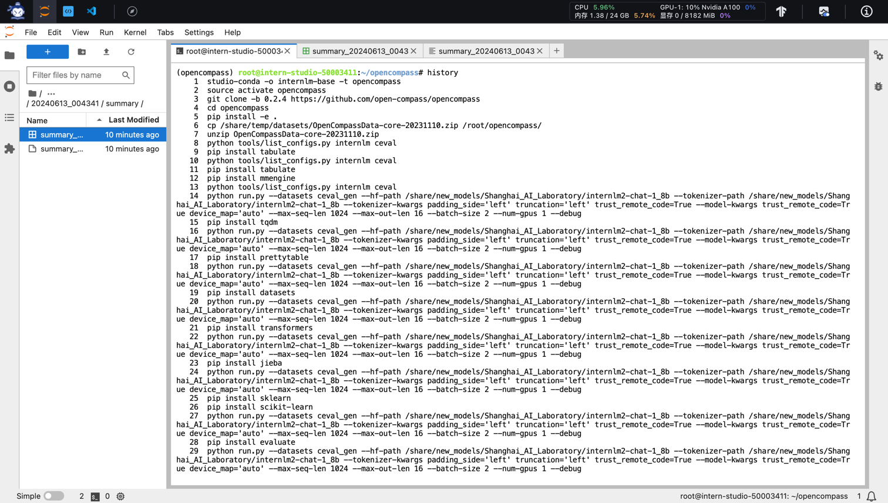
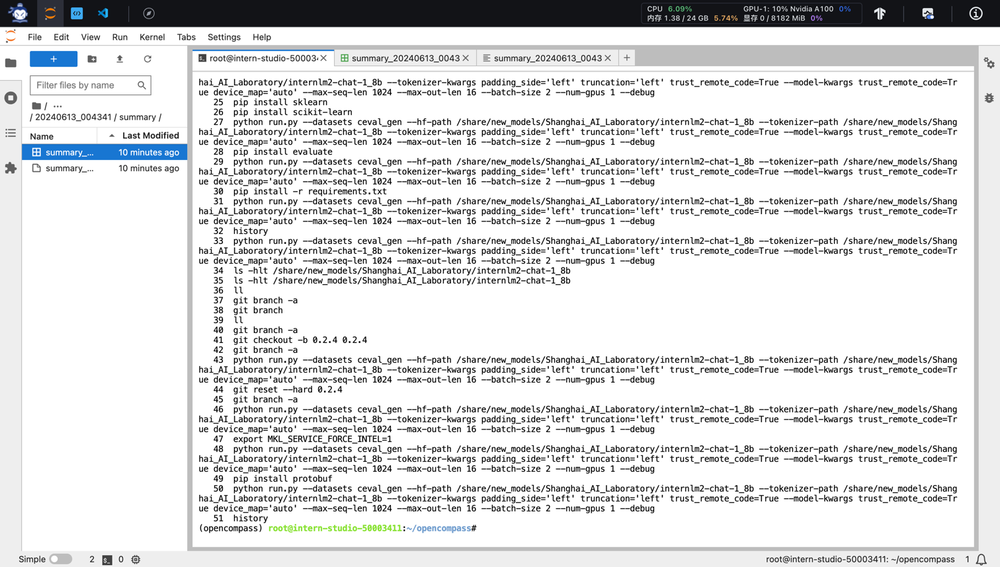

#### 总结
通过这节课程的学习，对于模型评测有了更直观的认识，后续可以再尝试其他数据集的评测来更全面的了解模型的能力。


