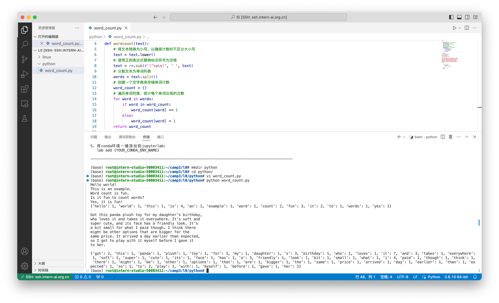
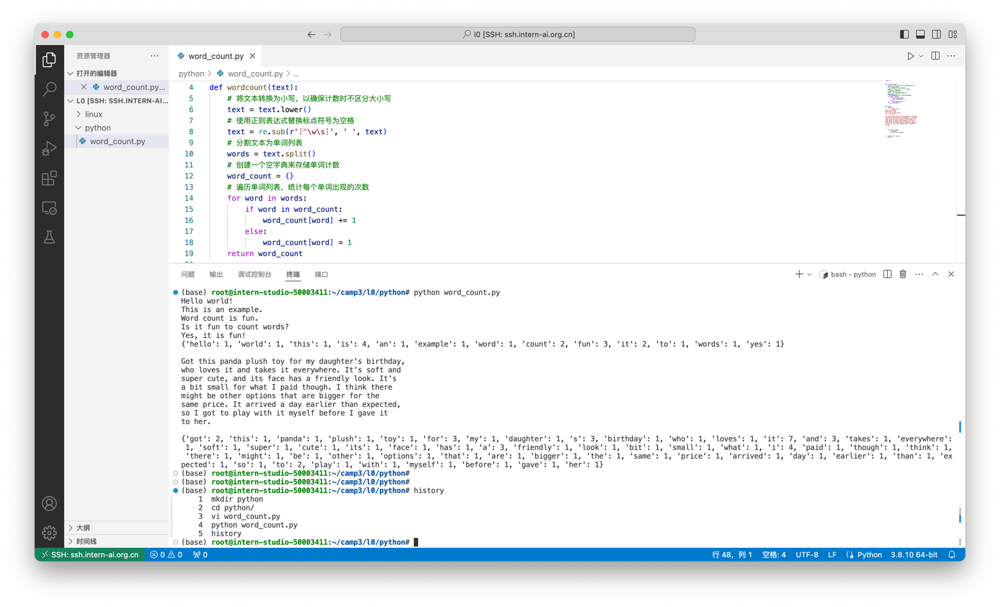
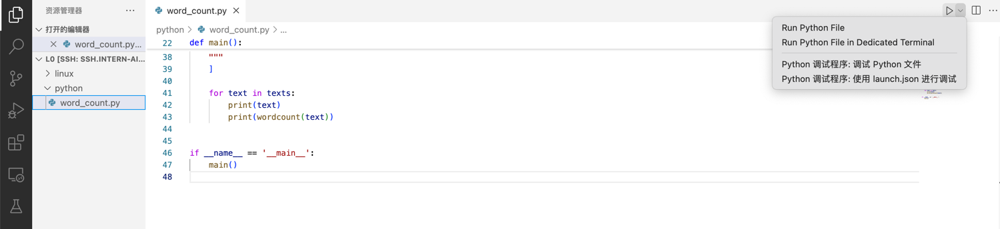
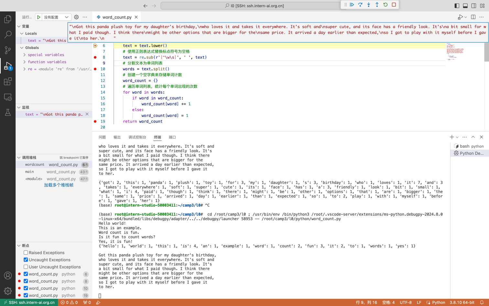
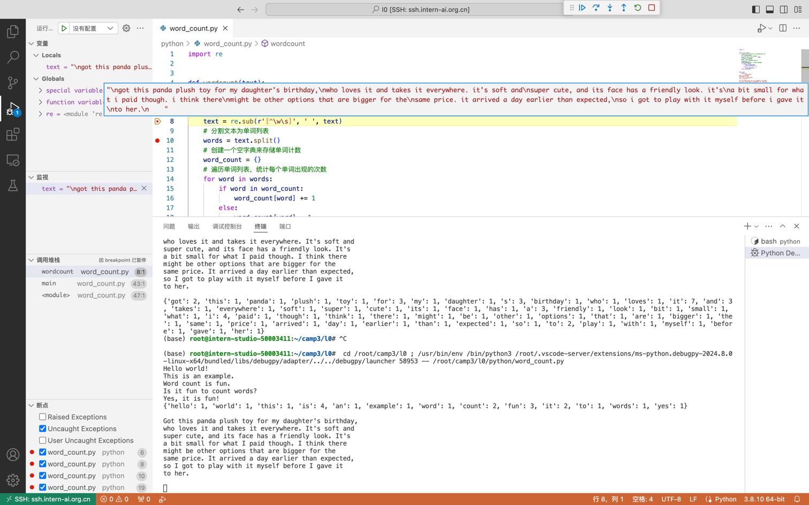
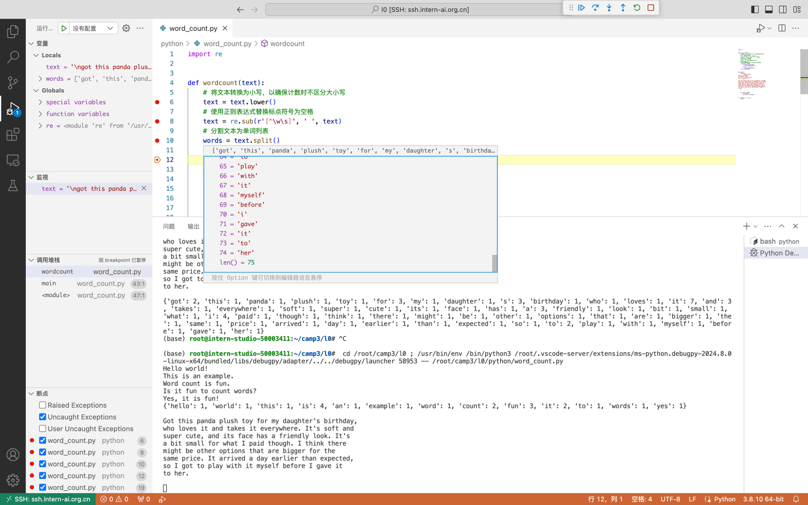
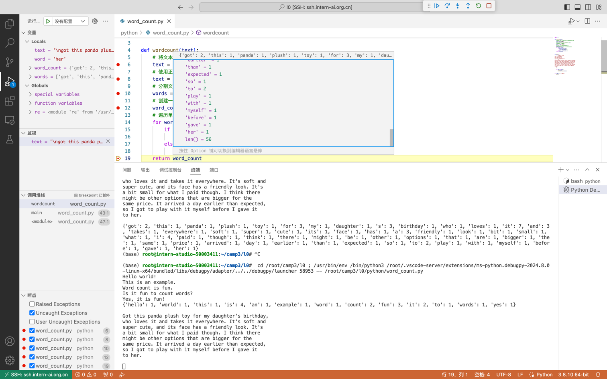
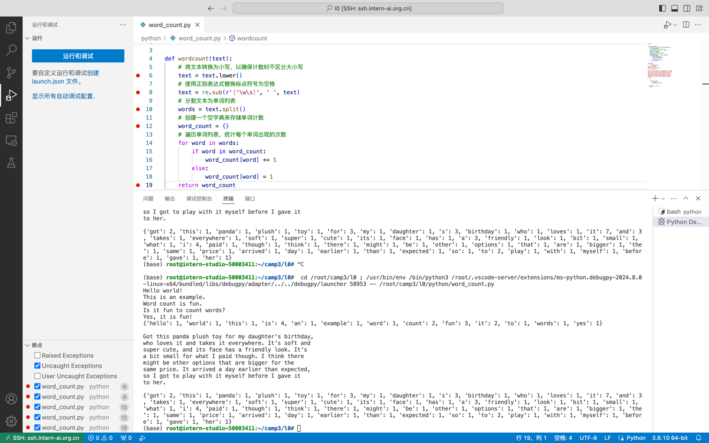

# [Python基础知识](https://github.com/InternLM/Tutorial/blob/camp3/docs/L0/Python/readme.md)

## 任务一: Python实现wordcount
> 请实现一个wordcount函数，统计英文字符串中每个单词出现的次数。返回一个字典，key为单词，value为对应单词出现的次数。

Eg:

Input:

```python
"""Hello world!  
This is an example.  
Word count is fun.  
Is it fun to count words?  
Yes, it is fun!"""
```

Output:

```python
{'hello': 1,'world!': 1,'this': 1,'is': 3,'an': 1,'example': 1,'word': 1, 
'count': 2,'fun': 1,'Is': 1,'it': 2,'to': 1,'words': 1,'Yes': 1,'fun': 1  }
```

TIPS：记得先去掉标点符号,然后把每个单词转换成小写。不需要考虑特别多的标点符号，只需要考虑实例输入中存在的就可以。

```python
text = """
Got this panda plush toy for my daughter's birthday,
who loves it and takes it everywhere. It's soft and
super cute, and its face has a friendly look. It's
a bit small for what I paid though. I think there
might be other options that are bigger for the
same price. It arrived a day earlier than expected,
so I got to play with it myself before I gave it
to her.
"""

def wordcount(text):
    pass

```


创建python任务目录
```shell
mkdir python
cd python/
```

编写wordcount函数
```shell
vi word_count.py
```

具体代码
```python
import re


def wordcount(text):
    # 将文本转换为小写，以确保计数时不区分大小写
    text = text.lower()
    # 使用正则表达式替换标点符号为空格
    text = re.sub(r'[^\w\s]', ' ', text)
    # 分割文本为单词列表
    words = text.split()
    # 创建一个空字典来存储单词计数
    word_count = {}
    # 遍历单词列表，统计每个单词出现的次数
    for word in words:
        if word in word_count:
            word_count[word] += 1
        else:
            word_count[word] = 1
    return word_count


def main():
    texts = [
        """Hello world!  
This is an example.  
Word count is fun.  
Is it fun to count words?  
Yes, it is fun!""",
        """
Got this panda plush toy for my daughter's birthday,
who loves it and takes it everywhere. It's soft and
super cute, and its face has a friendly look. It's
a bit small for what I paid though. I think there
might be other options that are bigger for the
same price. It arrived a day earlier than expected,
so I got to play with it myself before I gave it
to her.
    """
    ]

    for text in texts:
        print(text)
        print(wordcount(text))


if __name__ == '__main__':
    main()

```

运行代码
```shell
python word_count.py 
```

运行结果



历史操作
```shell
    1  mkdir python
    2  cd python/
    3  vi word_count.py
    4  python word_count.py 
    5  history
```



## 任务二: Vscode连接InternStudio debug笔记
> 请使用本地vscode连接远程开发机，将上面你写的wordcount函数在开发机上进行debug，体验debug的全流程，并完成一份debug笔记(需要截图)。

点击【Python 调试程序】开始调试代码


原始文本


转小写


去除标点符号


分词


分词统计


最终结果


