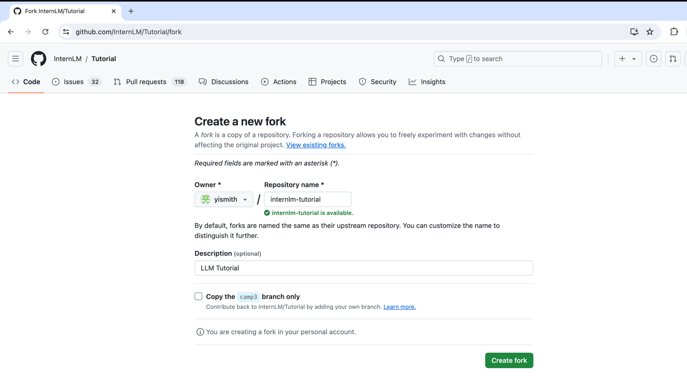
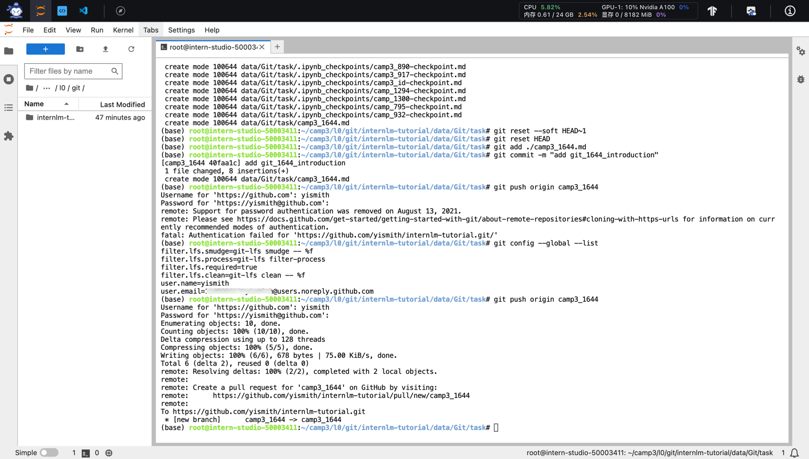
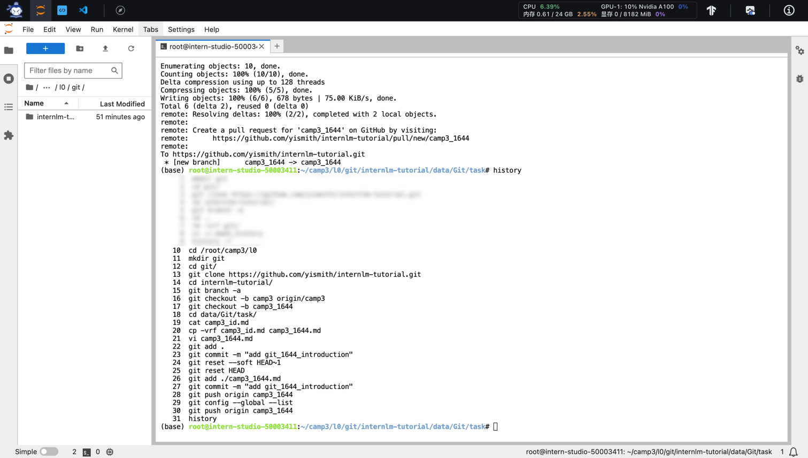
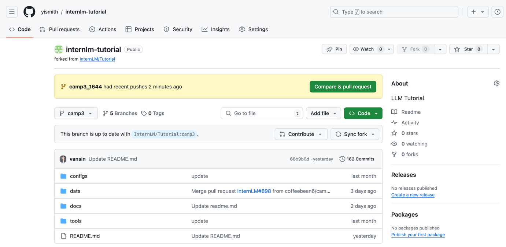
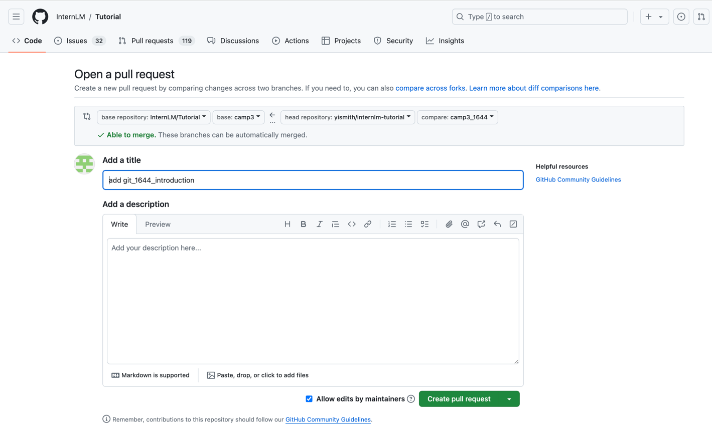
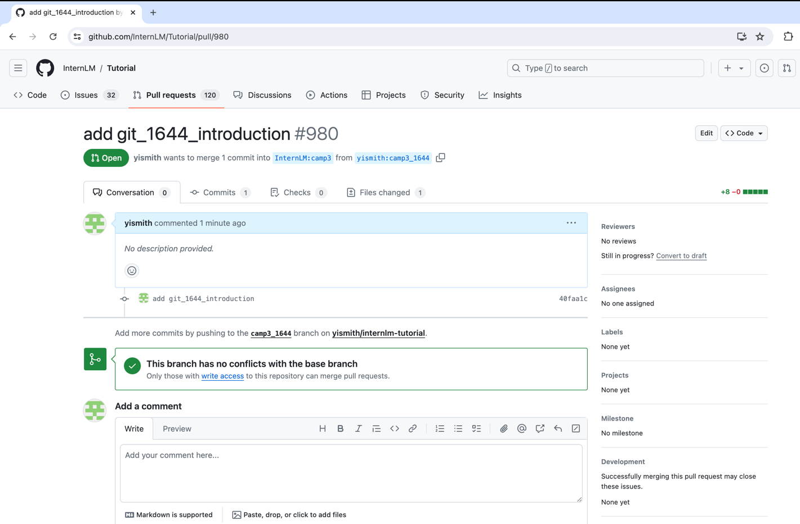

# [Git基础知识](https://github.com/InternLM/Tutorial/blob/camp3/docs/L0/Git/readme.md)

## 任务1: 破冰活动：自我介绍
### 目标

每位参与者提交一份自我介绍。
提交地址：https://github.com/InternLM/Tutorial 的 camp3 分支～


### 要求

1. 命名格式为 `camp3_<id>.md`，其中 `<id>` 是您的报名问卷ID。
2. 文件路径应为 `./data/Git/task/`。
3. 【大家可以叫我】内容可以是 GitHub 昵称、微信昵称或其他网名。
4. 在 GitHub 上创建一个 Pull Request，提供对应的 PR 链接。


fork仓库


创建git任务目录
```shell
cd /root/camp3/l0
mkdir git
cd git/
```

clone代码与切换分支
```shell
git clone https://github.com/yismith/internlm-tutorial.git
cd internlm-tutorial/
git branch -a
git checkout -b camp3 origin/camp3
```

新建分支
```shell
git checkout -b camp3_1644
```

编写自我介绍
```shell
cd data/Git/task/
cat camp3_id.md 
cp -vrf camp3_id.md camp3_1644.md
vi camp3_1644.md 
```

填入自我介绍内容
```markdown
【大家可以叫我】: yi
【坐标】：广州
【专业/职业】：程序员
【兴趣爱好】： ACGN
【项目技能】：python
【组队情况】：未组队
【本课程学习基础】：有一定编程基础
【本期活动目标】：llm从入门到未知
```

提交
```shell
git add .
git commit -m "add git_1644_introduction"
```

由于提交过程把notebook的checkpoints也提交了，通过reset的方式调整后重新提交
```shell
git reset --soft HEAD~1
git reset HEAD
git add ./camp3_1644.md 
git commit -m "add git_1644_introduction"
```

推送
```shell
git push origin camp3_1644
```



操作记录
```shell
   10  cd /root/camp3/l0
   11  mkdir git
   12  cd git/
   13  git clone https://github.com/yismith/internlm-tutorial.git
   14  cd internlm-tutorial/
   15  git branch -a
   16  git checkout -b camp3 origin/camp3
   17  git checkout -b camp3_1644
   18  cd data/Git/task/
   19  cat camp3_id.md 
   20  cp -vrf camp3_id.md camp3_1644.md
   21  vi camp3_1644.md 
   22  git add .
   23  git commit -m "add git_1644_introduction"
   24  git reset --soft HEAD~1
   25  git reset HEAD
   26  git add ./camp3_1644.md 
   27  git commit -m "add git_1644_introduction"
   28  git push origin camp3_1644
   29  git config --global --list
   30  git push origin camp3_1644
   31  history
```


创建PR




[PR链接](https://github.com/InternLM/Tutorial/pull/980)


## 任务2: 实践项目：构建个人项目
### 目标

创建一个个人仓库，用于提交笔记、心得体会或分享项目。


### 要求

1. 创建并维护一个公开的大模型相关项目或笔记仓库。
2. 提交作业时，提供您的 GitHub 仓库链接。
3. 如果您不常使用 GitHub，您可以选择其他代码管理平台，如 Gitee，并提交相应的链接。
4. 仓库介绍中添加超链接跳转 [GitHub 仓库](https://github.com/InternLM/Tutorial)（<u>[https://github.com/InternLM/Tutorial](https://github.com/InternLM/Tutorial)</u>）
5. 将此项目报名参加第三期实战营项目评选将解锁 30% A100 和 168 团队算力点资源，报名链接：[https://aicarrier.feishu.cn/wiki/DjY6whCO0inTu2kQN9Cchxgynme](https://aicarrier.feishu.cn/wiki/DjY6whCO0inTu2kQN9Cchxgynme)


[个人项目链接](https://github.com/yismith/llm-learning)
